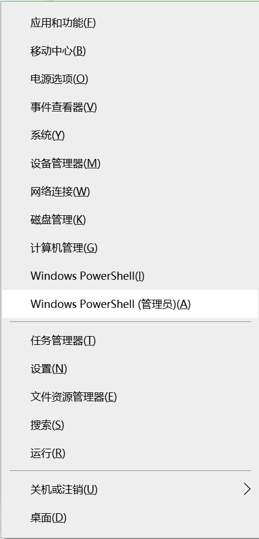

# Lab0 Tools & Guidance
[TOC]
## 1）实验目的
实验环境的安装与配置
## 2）实验步骤
以下介绍本人选择的WSL方案，获取Linux系统的方法
### 开启WSL支持
- 使用管理员权限安装SWL。按键盘的Win+x键，找到Windows PowerShell (管理员)(<u>A</u>)并点击进入该界面。

- 执行以下命令，重启系统即可激活WSL服务。
`Enable-WindowsOptionalFeature -Online -FeatureName Microsoft-Windows-Subsystem-Linux`

- 重启完成之后，按键盘的Win+r键，输入`appwiz.cpl`并回车，在左上角找到“启动或关闭Windows功能”。
- 在列表中勾选“使用于Linux的Windows子系统”。

- 在Microsoft Store搜索`Ubuntu`，并选择`Ubuntu 20.04 LTS`，点击下载。

- 点击进入`Ubuntu 20.04 LTS`，设置用户名以及密码，即可使用。


##### 
## 3）实验中遇到的问题和解决方法
### Ubuntu版本选择
一开始选择的Ubuntu版本为`Ubuntu 22.04.2 LTS`，输入`make qemu`后编译会一直卡在某一处，并且键入`Ctrl + c`也无法结束该进程
其原因为Ubuntu版本过高，需要安装QEMU模拟器的另一个版本
其实本问题的核心在于阅读教程不够细致，一看到满屏幕的英文就选择性跳过
- 通过输入以下命令完成
    ```bash
    $ sudo apt-get remove qemu-system-misc
    $ sudo apt-get install qemu-system-misc=1:4.2-3ubuntu6
    ```
- 或者可以选择下载`Ubuntu 20.04 LTS`版本的Ubuntu系统
### WSL提供的终端较难编辑
#### vim编辑器
在WSL上提供的终端上，相对比较好用的只有vim，虽然平常也有在使用vim，但大多只是作为一个插件在使用，并没有完全在vim的环境下流畅地使用的能力，用起来比较吃力
#### 终端字体颜色
本人的电脑初始设置对于vim编辑器中的语法高亮比较奇怪，特别是对于注释和背景的颜色，如下图：前者位深蓝色，后者为黑色。因此尤其难以辨认，对本人的眼睛造成了巨大的震撼
#### 解决方法
在Windows系统下的VScode软件下载WSL插件

在侧边栏最下面会多出一个`Remote Explorer`图标，点击后就可以看到已经安装好的WSL的Ubuntu系统，点击`Connect to WSL`图标即可开启链接
此时会弹出一个新的VSCode窗口，选择要打开的文件夹即可

同时，可以使用`Ctrl+Shift+~`打开终端
## 4）实验心得
### 安装Linux系统
本次实验需要Linux系统环境下进行，对于大多数同学的Windows系统的电脑，有两种常见解决方案
- 使用WSL，即Linux版的Windows子系统
- 在电脑上安装虚拟机

相对于安装虚拟机，SWL有以下好处
1. WSL占用资源更少，更加流畅
2. WSL可以直接对Windows文件系统下的文件进行读写，更加便于文件传输
3. 剪贴板互通，更加方便文本内容复制

在此次安装后深有体会，因为两种方法本人都尝试过。对于本次实验环境的搭建，使用WSL的方法是本人认为较为方便的。一方面，安装虚拟机步骤繁琐，占用大量时间、空间，并且附带一些本次实验不需要的功能，相当于安装好另一个完整的系统；而相对WSL仅仅是一个小小的子系统，安装较快速，使用方便，但有时候并不稳定，在本次实验中闪退了一两次
### 熟悉Shell命令和vim编辑器
因为之前的数据结构课程设计也有需要使用过Linux系统，所以本人对于其中基本的Shell命令和Vim编辑器的基本使用方法知晓一二，但在本次实验中还是有些力不从心，想要使用的一些命令需要上网查询
从中本人可以更加熟悉在Linux环境中的编程，极大地提高了本人的能力
以下是本人认为可以提高效率的一些命令，可能会有不完全，但确实是比较常用的操作
- 对于Shell命令
  - `ls`(list files)可以查看当前目录下的文件。若是想查看所有文件，可以使用`ll`或`ls -a`
  - `cd`可以切换目录
  - `mkdir`创建目录
  - `vim`(创建文件并)进入编辑界面
  - `rm`删除文件。若想删除文件夹，可以使用`rm -rf`，该命令可以级联删除文件夹以及文件夹中的所有内容，因此需要尤其慎重
  - 通配符`*`可以匹配0个或多个字符，例如`rm *txt`可以删除当前目录下所有以`txt`结尾的文件
  - 通配符`.`可以匹配1个或多个字符
  - 管道`|`,可以将多个命令串联起来，将前一个命令的输出作为下一个命令的输入，实现更复杂的操作。例如，`ls -l | grep ".txt"`可以列出当前目录下所有以.txt为后缀的文件的详细信息
- 对于Vim编辑器
  - h, j, k, l移动光标
  - nh, nj, nk, nl: 相对移动n个字符
  - w: 下一个单词的开头;
  - e: 本单词or下一个单词的结尾;
  - b: 本单词or上一个单词的开头;
  - ge: 上一个单词的结尾;
  - 0: 该行首， $: 该行尾
  - gg: 第一行首，G: 最后一行首
  - H, M, L: 移动到屏幕中看得到的第一行、中间一行和最后一行
  - nG: 移动到第n行
  - dd: 剪切一行
  - x: 删除光标所在
  - yw: 复制一个单词
  - yy: 复制一行
  - p: 粘贴
  - `/target`: 查找，n下一个，N上一个
  - `:s/old/new`: 将光标**所在行第一个**old替换为new
  - `:s/old/new/g`: 将光标**所在行所有**old替换为new 
  - `:%s/old/new/gc`: 全文替换，每次询问是否替换
  - `:wq` : 保存并退出
  - `vim filename1 filename2 filename3 ...`打开多个文件
  - `:ls` : 查看共有多少个文件
  - `:b n` : 切换到第n个文件
  - `:sp / vs` : 竖着/横着打开相同的文件
  - 两次`Ctrl + w`: 接上面切换窗口