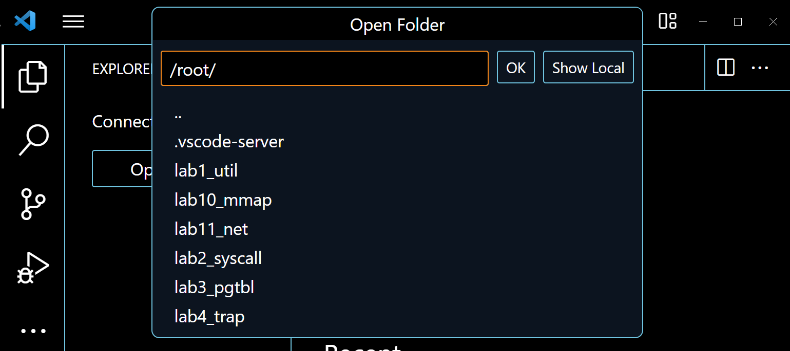

# [Lab1 Xv6 and Unix utilities](https://pdos.csail.mit.edu/6.828/2020/labs/util.html)

[TOC]

## 1. Boot xv6 (easy)

### 1）实验目的

利用QEMU模拟器启动xv6系统

### 2）实验步骤

#### 配置实验环境

在Ubuntu操作系统中，使用以下安装实验所需要的GNU工具链和QEMU模拟器

```bash
$ sudo apt update
$ sudo apt install build-essential gcc make perl dkms git gcc-riscv64-unknown-elf gdb-multiarch qemu-system-misc
```

#### 下载实验所需代码
使用git clone获取实验所需代码
```bash
git clone git://g.csail.mit.edu/xv6-labs-2020
```
进入实验代码文件夹
```bash
cd xv6-labs-2020
```
从master分支切换到util分支
```bash
git checkout util
```
#### 启动xv6
在xv6-labs-2020目录中
```bash
make qemu
```
即可编译并运行xv6系统

看到如下输出，即说明成功编译并运行xv6系统
```bash
xv6 kernel is booting

hart 2 starting
hart 1 starting
init: starting sh
$ 
```
#### 测试xv6系统
在命令行中输入`ls`，即可创建`ls`子进程，该命令的功能为展示当前目录下的所有文件，看到如下输出，即说明测试成功
```bash
$ ls
.              1 1 1024
..             1 1 1024
README         2 2 2059
xargstest.sh   2 3 93
cat            2 4 24256
echo           2 5 23080
forktest       2 6 13272
grep           2 7 27560
init           2 8 23816
kill           2 9 23024
ln             2 10 22880
ls             2 11 26448
mkdir          2 12 23176
rm             2 13 23160
sh             2 14 41976
stressfs       2 15 24016
usertests      2 16 148456
grind          2 17 38144
wc             2 18 25344
zombie         2 19 22408
console        3 20 0
```
#### 其他测试
在xv6系统中按下`Ctrl + p`会有如下输出
```bash
1 sleep  init
2 sleep  sh
```
在 xv6 中按下 `Ctrl + a` ，松开，然后按下` x `即可退出 xv6 系统。

### 3）实验中遇到的问题和解决方法
主要是一些关于环境配置的问题，这里摘取`envconfig`文件中的部分内容
#### Ubuntu版本选择
一开始选择的Ubuntu版本为`Ubuntu 22.04.2 LTS`，输入`make qemu`后编译会一直卡在某一处，并且键入`Ctrl + c`也无法结束该进程
其原因为Ubuntu版本过高，需要安装QEMU模拟器的另一个版本
其实本问题的核心在于阅读教程不够细致，一看到满屏幕的英文就选择性跳过
- 通过输入以下命令完成
    ```bash
    $ sudo apt-get remove qemu-system-misc
    $ sudo apt-get install qemu-system-misc=1:4.2-3ubuntu6
    ```
- 或者可以选择下载`Ubuntu 20.04 LTS`版本的Ubuntu系统
#### WSL提供的终端较难编辑
##### vim编辑器
在WSL上提供的终端上，相对比较好用的只有vim，虽然平常也有在使用vim，但大多只是作为一个插件在使用，并没有完全在vim的环境下流畅地使用的能力，用起来比较吃力
##### 终端字体颜色
本人的电脑初始设置对于vim编辑器中的语法高亮比较奇怪，特别是对于注释和背景的颜色，如下图：前者位深蓝色，后者为黑色。因此尤其难以辨认，对本人的眼睛造成了巨大的震撼
##### 解决方法
在Windows系统下的VScode软件下载WSL插件

在侧边栏最下面会多出一个`Remote Explorer`图标，点击后就可以看到已经安装好的WSL的Ubuntu系统，点击`Connect to WSL`图标即可开启链接
此时会弹出一个心得VSCode窗口，选择要打开的文件夹即可

同时，可以使用`Ctrl+Shift+~`打开终端

### 4）实验心得

#### 英文很重要
当我看到实验的官网中满屏英文的时候，感到非常头疼，阅读的时候需要放慢速度，有些语句需要通过翻译软件才能进一步深刻地理解其中所表达的意思，否则可能会给接下来的步骤带来一些错误。例如，在阅读[Tools Used in 6.S081](https://pdos.csail.mit.edu/6.828/2020/tools.html)页面的同时，我一开始错误认为其中所有命令都得执行，但其实我们仅仅需要找到我们对应的设备，执行其大标题之下的命令即可

同时，我也深刻地意识到:大部分优质的编程语言和开发工具的官方文档、教程和资源都是用英文编写的。只有掌握英文能够让我们尽可能好地阅读和理解这些关键资料，从而更好地学习和掌握新的技术。同时，英文是编程领域的通用语言，无论是在开源社区、技术论坛还是开发者社交平台上，大多数讨论和交流都是用英文进行的。通过阅读和参与英文的讨论，我们可以获得更广泛的知识和观点，与全球范围内的开发者进行交流，并从他们的经验中受益

#### 认识Linux系统
对于Linux系统，虽然在上一学期中的数据结构课程设计中有所接触，知晓了一些关于shell、gcc、g++以及make的相关知识，但是仅仅局限在一些代码量较小的应用上，对于其中的深刻内涵，本次我在实验中得到进一步认识

Linux是一种开源操作系统，它是基于Unix的操作系统。与Windows或macOS等闭源操作系统不同，Linux的源代码对公众开放，用户可以自由地查看、修改和分发它。在使用它的同时，我也深刻感受到其中使用方法的不同，特别是其中下载软件的方法，相对于Windows来说更加便捷和快速，但是相信这也需要一定的计算机基础，否则确实比较难以使用和界面不友好。相对于具有丰富GUI的Windows来说，我是用的Linux系统的GUI相对逊色一点，不知道是否和本人的电脑配置有关，但对于用户利用鼠标进行点击、拖动图标来说，系统的界面反馈确实不如Windows系统中的流畅；甚至于WSL就只有一个小小的命令行窗口，若是一开始接触电脑就是两眼抹黑了。但相信在开发的过程中，还是得看Linux系统中提供的各种支持，因为Linux可以运行在各种硬件平台上，从个人电脑到服务器、嵌入式设备等都可以使用，同时用户还可以根据自己的需求进行调整和配置

#### Shell

##### 含义
其英文含义为“外壳”，因此相对于kernel内核来说，非常生动形象地说明了：它是建立在内核的基础上，面向用户的命令接口，我们可以键入各种各样的Shell命令帮助我们完成相应的操作
##### 两种形式
1. 终端(Terminal)：在无图形界面下运行的shell环境，它提供了命令行界面，用户可以输入文本命令和系统交互。终端通常是以窗口形式出现，用户可以在其中执行命令、编辑文件等操作。在终端中，常见的shell程序包括Bash（Bourne Again SHell）、Zsh（Z Shell）、Fish等。
2. 桌面上的Shell：当你在Linux系统中使用图形用户界面（Graphical User Interface，GUI）时，会有一个类似于Windows的MS-DOS运行窗口的界面，这也被称为桌面上的Shell。它通常是一个图形化的终端仿真器（Terminal Emulator），用于在桌面环境中运行shell命令。常见的桌面上Shell程序有GNOME Terminal、Konsole、Xfce Terminal等。

## 2. sleep (easy)
### 1）实验目的
> Implement the UNIX program sleep for xv6; your sleep should pause for a user-specified number of ticks. A tick is a notion of time defined by the xv6 kernel, namely the time between two interrupts from the timer chip. Your solution should be in the file user/sleep.c.
> 实现xv6的UNIX程序`sleep`，`sleep`应该暂停一段用户指定的tick周期数。一个tick周期是xv6内核定义的时间概念，即来自定时器芯片的两次中断之间的时间。您的解决方案应该在`user/sleep.c`文件中。
### 2）实验步骤
#### 编写代码
进入user文件夹
```bash
$ cd user
```
新建`sleep.c`文件并编写程序
```bash
$ vim sleep.c
```
代码如下
```c
#include "kernel/types.h"
#include "user/user.h"

int main(int argc, char* argv[]) {
    if (argc != 2) {
        fprintf(2, "Usage: sleep <TIME>\n");
        exit(1);
    }
    sleep(atoi(argv[1]));
    exit(0);
}
```
- 利用`argc != 2`检查参数个数是否正确
- 若不正确使用`exit(1)`异常退出
- 正确则利用系统调用`sleep`
- 注意其中需要将输入参数`argv[1]`通过`atoi`从字符串转换为`int`，才可作为`sleep`的输入
#### 配置编译
为了使得能够编译所编写的`sleep.c`文件，我们需要在`Makefile`文件中进行修改
回到父级目录
```bash
$ cd ..
```
编辑`Makefile`文件
```bash
$ vim Makefile
```
在`UPROGS`项中最后一行添加`$U/_sleep\`，从而使得编译器更够对该文件进行链接编译
```makefile
  ...
  $U/_wc\
  $U/_zombie\
  $U/_sleep\ 
```
#### 测试程序
进入QEMU模拟器
```bash
$ make qemu
```
进行`sleep`程序的测试
```bash
$ sleep
Usage: sleep <TIME>
$ sleep 23 222
Usage: sleep <TIME>
$ sleep 3
```

键入`Ctrl+a`，松开，然后键入`x`，退出xv6系统，并进行单元测试
```bash
root@LAPTOP-UER420HO:~/util_lab1# ./grade-lab-util  sleep
make: 'kernel/kernel' is up to date.
== Test sleep, no arguments == sleep, no arguments: OK (1.9s)
== Test sleep, returns == sleep, returns: OK (0.8s)
== Test sleep, makes syscall == sleep, makes syscall: OK (0.9s)
```

### 3）实验中遇到的问题和解决方法
#### 头文件顺序
一开始我引入的头文件顺序如下
```c
#include "user/user.h"
#include "kernel/types.h"
```
会出现如下错误

原因在于编译器需要先编译`kernel/types.h`中对于`uint`等各种数据类型的定义，然后才能识别出`user/user.h`中的调用
将两个头文件顺序调换如下即可
```c
#include "kernel/types.h"
#include "user/user.h"
```

### 4）实验心得
#### 输入参数个数
之前学习中很少接触到命令行的相关代码，因此写的`main`函数并没有对输入参数有太多的关注，但在此判断命令行输入参数的工作十分重要。
通过判断参数个数，我们可以可以确保程序接收到了正确的参数数量，并避免在使用这些参数之前发生错误。例如，如果程序期望接收两个参数，但实际上只提供了一个或没有参数，那么在没有进行参数个数检查的情况下，程序可能会尝试访问不存在的参数，导致错误或异常。
此外，参数个数的判断还可以用于向用户提供有关程序的正确用法的提示信息。如果参数个数不符合预期，可以输出一条错误消息，说明所需的参数数量和格式，以帮助用户正确使用程序。
对于`int main(int argc, char* argv[])`
- `argc`是输入的参数个数
- `argv[]`是存储输入参数的字符串数组，需要注意的是`argv[0]`存储的是执行程序的文件名或路径
#### 错误信息输出
如果参数个数不符合预期，可以输出一条错误消息，从而达到用户友好性。例如`sleep.c'`中若判断参数人不等于2个，通过系统调用`fprintf(2, "Usage: sleep <TIME>\n");`进入提示。其中第一个参数是文件描述符，0 表示标准输入，1 表示标准输出，2 表示标准错误；第二个参数是要打印的字符串
#### 程序退出
对于程序的正确或异常需要不同的退出，我们利用`exit`系统调用进行。
需要注意的是返回值是0表示程序成功，返回值是1表示程序异常。这来自于历史中的约定俗成，对于shell中的判断有很大帮助，以及成功的情况只有一种，但异常可能由很多种情况引起

## 2. pingpong (easy)
### 1）实验目的
> Write a program that uses UNIX system calls to ''ping-pong'' a byte between two processes over a pair of pipes, one for each direction. The parent should send a byte to the child; the child should print "`<pid>`: received ping", where `<pid>` is its process ID, write the byte on the pipe to the parent, and exit; the parent should read the byte from the child, print "`<pid>`: received pong", and exit. Your solution should be in the file `user/pingpong.c`.
> 使用 UNIX 系统调用编写一个程序 pingpong ，在一对管道上实现两个进程之间的通信。父进程应该通过第一个管道给子进程发送一个信息 “ping”，子进程接收父进程的信息后打印 "`<pid>`: received ping" ，其中是其进程 ID 。然后子进程通过另一个管道发送一个信息 “pong” 给父进程，父进程接收子进程的信息然后打印 "`<pid>`: received pong" ，然后退出。
### 2）实验步骤
#### 编写代码
进入user文件夹
```bash
$ cd user
```
新建`pingpong.c`文件并编写程序
```bash
$ vim pingpong.c
```
代码如下
```c
#include "kernel/types.h"
#include "user/user.h"

int main(int argc, char* argv[]) {
    if (argc != 1) {
        fprintf(2, "Error: argument!\n");
        exit(1);
    }
    int parent2child[2]; // 传递数据管道
    int child2parent[2];
    pipe(parent2child);
    pipe(child2parent);
    char ping_buf[4]; // 接受消息的缓冲区
    char pong_buf[4]; // 接受消息的缓冲区
    int pid = fork(); // 创建子进程
    if (pid > 0) { // 父进程
        close(parent2child[0]);
        close(child2parent[1]);
        write(parent2child[1], "ping",4); // 父进程写入管道
        wait((int*)0); // 等待子进程完成才能读
        if (read(child2parent[0], pong_buf, 4) == 4
                && strcmp(pong_buf, "pong") == 0) { // 读取并比较
            printf("%d: received pong\n", getpid());
        }
        close(parent2child[1]);
        close(child2parent[0]);
        exit(0);
    }
    else if (pid == 0) {
        close(parent2child[1]);
        close(child2parent[0]);
        if (read(parent2child[0], ping_buf, 4) == 4
                && strcmp(ping_buf, "ping") == 0) { // 子进程先读后写
            printf("%d: received ping\n", getpid());
        }
        write(child2parent[1], "pong", 4);
        close(parent2child[0]);
        close(child2parent[1]);
        exit(0);
    }
    else {
        printf("Fork error!\n");
        close(parent2child[0]);
        close(parent2child[1]);
        close(child2parent[0]);
        close(child2parent[1]);
        exit(1);
    }
}
```

- 利用`pipe`系统调用建立管道，从而帮助进程之间进行通信，其中传入参数为长度为2的`int`类型数组的首地址，不妨设`pipe(p)`，则`p[0]`为管道读取端，`p[1]`为管道写入端。从而使得父子进程之间可以传递"ping"/"pong"字符串
- 通过`fork`系统调用创建进程，一次调用两次返回，我们在此通过返回的进程号`pid`判断当前执行的是哪一个进程，若`pid == 0`则说明为子进程；若`pid > 0`则说明为父进程，判断不同的进程从而进行不同的操作。需要注意的是若返回的进程号`pid < 0`则说明`fork`创建异常
- 使用`write`系统调用传入三个参数，把字符串 "ping" 写入管道一，第一个参数为管道的写入端文件描述符，第二个参数为写入的字符串，第三个参数为写入的字符串长度
- 利用`wait`系统调用使父进程等待子进程

#### 配置编译
为了使得能够编译所编写的`pingpong.c`文件，我们需要在`Makefile`文件中进行修改
回到父级目录
```bash
$ cd ..
```
编辑`Makefile`文件
```bash
$ vim Makefile
```
在`UPROGS`项中最后一行添加`$U/_pingpong\`使得编译器可以对该文件进行链接编译
```makefile
  ...
  $U/_zombie\
  $U/_sleep\ 
  $U/_pingpong\ 
```
#### 测试程序
进入QEMU模拟器
```bash
$ make qemu
```
进行`pingpong`程序的测试
```bash
$ pingpong
4: received ping
3: received pong
```

键入`Ctrl+a`，松开，然后键入`x`，退出xv6系统，并进行单元测试
```bash
root@LAPTOP-UER420HO:~/util_lab1# ./grade-lab-util pingpong
make: 'kernel/kernel' is up to date.
== Test pingpong == pingpong: OK (2.0s)
```
### 3）实验中遇到的问题和解决方法
#### 使用系统调用
一开始我对于实验题干中提到的`pipe`系统调用不是很熟悉，导致不太明白题目中想要我们达到的效果是什么
通过上网查询相关资料以及阅读相关源码，其中关于`pipe`的实现就在`kernel/pipe.c`中
#### 及时关闭管道
在编写程序时，我们需要及时关闭不需要的文件描述符，否则将会耗尽系统内存。其实在一开始我并没有注意到这个问题，因为在该程序中没有关闭并不会造成什么影响。直到在网上查阅相关资料后，才明白上述知识
所以对于不管判断进入那个进程，先将后面所需要使用的文件描述符使用代码写好，然后再在最前面将所没有使用到的文件描述符释放关闭
### 4）实验心得
#### 查阅给的资料
在进行实验之前，确保对实验所涉及的相关知识有一定的了解是非常重要。这些知识包括与实验相关的系统调用和编程概念

对于本次实验中使用到的系统调用，例如`pipe、fork`、`read`和`write`，需要事先熟悉它们的使用方法和参数含义

#### 管道通信
管道通信是一种在操作系统中用于进程间通信的机制。它允许一个进程将输出发送给另一个进程，而无需使用显式的共享内存或消息传递机制

在管道通信中，进程之间通过一个虚拟的管道连接起来。这个管道可以被视为一个字节流，数据从一个进程的输出端写入管道，然后从另一个进程的输入端读取。数据在管道中按照先进先出（FIFO）的顺序进行传输

管道通信通常用于父子进程之间或者具有血缘关系的进程间通信。在Unix和类Unix系统中，可以使用`pipe()`系统调用创建管道。在创建管道后，进程可以使用`write()`函数将数据写入管道，而另一个进程可以使用`read()`函数从管道中读取数据。

管道通信的一个重要特点是单向性，即数据只能在一个方向上流动。如果需要双向通信，需要创建两个管道，或者使用其他的进程间通信机制。就像本实验，我们建立了两个管道用于父进程和子进程之间的相互传递消息

同时，查看参考资料的时候，我并不是很理解为什么判断进入到某个进程之后，就首先将本进程不需要的读端或者写端关闭
这是因为写进程完全关闭管道端时，文件结束的条件被正确地传递给读进程。而读进程完全关闭管道端时，写进程**无需等待**继续写数据，否则就会继续阻塞

#### 对于fork的使用
##### 父子进程的判断
在之前操作系统课上提到的`fork()`，老师所讲的一次调用两次返回，我在此深有体会，同时我们可以通过返回值确定当前在CPU上运行的是哪一个进程，从而执行不同的逻辑功能，甚至说还可以进行错误判断
父子进程相互独立，具有不同的进程ID。同时我们也不能决定它们的执行顺序，这是OS调度程序所决定的，因此我们需要做好判断
##### 父进程等待
父进程等待，一方面可以获得子进程的信息，得知子进程的运行结果；另一方面可以保证子进程先退出，父进程后退出；最后进程退出的时候会先进入将是状态，有可能出现内存泄漏的问题，因此需要通过父进程等待，释放子进程的相关占用资源
所谓僵尸进程，就是OS中已经结束执行但仍然保留在进程表中的一种特殊进程状态。当一个进程完成了它的工作并退出，但其父进程还没有调用`wait`或相关系统调用来获取该子进程的终止状态时，该子进程就会变成僵尸进程。当一个进程完成了它的工作并退出，但其父进程还没有调用wait()或相关系统调用来获取该子进程的终止状态时，该子进程就会变成僵尸进程

## 3. primes (moderate)/(hard)
### 1）实验目的
> Write a concurrent version of prime sieve using pipes. This idea is due to Doug McIlroy, inventor of Unix pipes. The picture halfway down this page and the surrounding text explain how to do it. Your solution should be in the file user/primes.c.
> 使用管道编写一个prime sieve的并发版本。这个想法要归功于Unix管道的发明者Doug McIlroy。这个页面中间的图片和周围的文字解释了如何做到这一点。你的解决方案应该在`user/primes.c`文件中
### 2）实验步骤
#### 编写代码
在`user/primes.c`文件中编写程序
```c
#include "kernel/types.h"
#include "user/user.h"

void prime(int* p);

int main(int argc, char* argv[]) {
    // 0 for read 1 for write
    int p[2];
    pipe(p);

    for (int i = 2; i <= 35; ++i) {
        write(p[1], &i, sizeof(i));
    }

    int pid = fork();
    // error fork
    if (pid < 0) {
        printf("Fork error!\n");
        close(p[0]);
        close(p[1]);
        exit(1);
    }
    // parent process
    else if (pid > 0) {
        close(p[0]);
        close(p[1]);
        wait((int*) 0);
        exit(0);
    }
    // children processes
    else {
        close(p[1]);
        prime(p);
        close(p[0]);
        exit(0);
    }
}

void prime(int* p) {
    int num_prime;
    int length = read(p[0], &num_prime, sizeof(num_prime));
    if (length == 0) {
        close(p[0]);
        exit(0);
    }
    else {
        printf("prime %d\n", num_prime);
    }
    int num;
    int p_next[2];
    pipe(p_next);
    int pid = fork();
    if (pid < 0) {
        printf("Fork error!\n");
        close(p[0]);
        close(p[1]);
        exit(1);
    }
    else if (pid > 0) {
        close(p_next[0]);
        while (read(p[0], &num, sizeof(num))) {
            if (num % num_prime != 0) {
                write(p_next[1], &num, sizeof(num));
            }
        }
        close(p[0]);
        close(p_next[1]);
        wait((int*)0);
        exit(0);
    }
    else {
        close(p[0]);
        close(p_next[1]);
        prime(p_next);
        close(p_next[0]);
        exit(0);
    }
}
```
- 利用创建子进程和管道，该程序实现了并发寻找素数的功能
- 首先将2-35所有数字都写入管道
- 然后创建进程，通过返回值判断是哪个进程，若是父进程就等待子进程完成；若是子进程就进入`prime()`函数进行筛选
- `prime()`函数中的逻辑为传入指向管道文件描述符的指针，从父进程中写入管道的数字中筛选。筛选的方法为：选择第一个数字打印出来，因为必为素数；然后利用所选数字对管道中剩余数字进行求模检查，将能被所选数字整除的数字筛出，剩余数字写入新创建的管道，这样就完成了一轮的筛选；最后递归地将下一轮筛选交给新生成的子进程

#### 配置编译
修改`Makefile`文件，在`UPROGS`项中最后一行添加`$U/_primes\`使得编译器可以对该文件进行链接编译
```makefile
  ...
  $U/_sleep\ 
  $U/_pingpong\
  $U/_primes\ 
```
#### 测试程序
进入QEMU模拟器
```bash
$ make qemu
```
进行`primes`程序的测试
```bash
$ primes
prime 2
prime 3
prime 5
prime 7
prime 11
prime 13
prime 17
prime 19
prime 23
prime 29
prime 31
```

键入`Ctrl+a`，松开，然后键入`x`，退出xv6系统，并进行单元测试
```bash
root@LAPTOP-UER420HO:~/lab1_util# ./grade-lab-util primes
make: 'kernel/kernel' is up to date.
== Test primes == primes: OK (1.0s)
```
### 3）实验中遇到的问题和解决方法
#### 这个逻辑不好想出来
这是本人较为少有的并发编程的经历，对于`fork()`函数有了更加深刻的认识。同时，本实验的逻辑并不是很容易理解，因此对于问题的解法还是花费了比较多的时间，但是将逻辑理清楚之后就较容易地可以实现。实现逻辑在实验代码下有解释

### 4）实验心得

#### 及时关闭文件描述符

还需要及时关闭不需要的文件描述符，根据实验提示，程序将达到35之前就耗尽资源。这里提醒我们需要合理使用计算机的资源，虽然随着硬件的发展和软件的提升，程序员越来越不用考虑资源的相关事宜，但对于操作系统本身，我们对其的深刻了解，它的一个重要任务就是对计算机资源进行合理的管理和使用。因此此处更加加深了我对此的理解，从而在今后的编程过程中，我们应该注意资源的回收，从而保证不出现资源的浪费和泄露，进一步提高程序的性能

#### 使用write()和read()函数

当调用read()函数时，它会尝试从文件描述符指定的文件（或管道）中读取数据，并将数据存储到指定的内存位置。在这种情况下，read()函数将从管道的读端读取数据，并将数据存储到相应变量中。

read()函数的返回值表示实际读取的字节数。如果返回值为负数，表示读取过程中发生错误。如果返回值为0，表示已经读取到了文件的末尾（在管道中，表示没有更多的数据可读）。如果返回值为正数，表示成功读取了指定数量的字节

需要注意的是，read()函数是一个阻塞调用，也就是说，如果没有可读取的数据，它会一直等待直到有数据可读

当调用write()函数时，它会尝试将指定的数据从内存位置写入到文件描述符指定的文件（或管道）。在这种情况下，write()函数将num变量中的数据写入到管道的写端

write()函数的返回值表示实际写入的字节数。如果返回值为负数，表示写入过程中发生错误。如果返回值为正数，表示成功写入了指定数量的字节

需要注意的是，write()函数可能是一个阻塞调用，具体取决于管道的状态和操作系统的行为。如果管道已满，write()函数可能会阻塞，直到有足够的空间来写入数据。在某些情况下，可以使用非阻塞模式或设置超时选项来避免阻塞

需要注意的是，在使用管道进行进程间通信时，读端和写端的配对是非常重要的。读端负责从管道中读取数据，写端负责向管道中写入数据。如果读端和写端不匹配，可能会导致通信失败或产生意外的结果。当然在本程序中，我们向管道中写入数据和子进程读取数据时并发进行的，其中可能会造成阻塞，不过这依赖于操作系统的调度程序，当子进程因此进入阻塞状态的时候，操作系统就会调度其他进程。因此不必担心当父进程没有写入数据的时候，调度到子进程没数据读取

## 4. find (moderate)
### 1）实验目的
> Write a simple version of the UNIX find program: find all the files in a directory tree with a specific name. Your solution should be in the file `user/find`.c.
> 编写一个简单版本的UNIX查找程序：查找目录树中具有特定名称的所有文件。您的解决方案应该在文件`user/find.c`中。
### 2）实验步骤
#### 编写代码
在`user/primes.c`文件中编写程序
```c
#include "kernel/types.h"
#include "kernel/stat.h"
#include "user/user.h"
#include "kernel/fs.h"

char* fmtname(char *path) {
	char* p = path;
	while (*p) {
		++p;
	}
	while (*p != '/' && p != path) {
		--p;
	}
	return p == path ? p: ++p;
}

void find(char* path, char* filename) {
	char buf[512];
	char* p;
	int fd;
	struct stat st;
	struct dirent de;

	if ((fd = open(path, 0)) < 0) {
		fprintf(2, "find: cannot open %s\n", path);
		exit(1);
	}
	if (fstat(fd, &st) < 0) {
		fprintf(2, "find: cannnot stat %s\n", path);
		close(fd);
		exit(1);
	}

	switch(st.type) {
		case T_FILE:
			if (strcmp(fmtname(path), filename) == 0) {
				printf("%s\n", path);
			}
			break;
		case T_DIR:
			if (strlen(path) + 1 + DIRSIZ + 1 > sizeof(buf)) {
				fprintf(2, "find: path too long\n");
				break;
			}
			strcpy(buf, path);
			p = buf + strlen(buf);
			*p++ = '/';
			while (read(fd, &de, sizeof(de)) == sizeof(de)) {
				if (de.inum == 0)
					continue;
				if (strcmp(de.name, ".") == 0 || strcmp(de.name, "..") == 0)
					continue;
				memmove(p, de.name, DIRSIZ);
				p[DIRSIZ] = 0;
				find(buf, filename);
			}
			break;
	}
	close(fd);
}

int main(int argc, char* argv[]) {
	if (argc != 3) {
		fprintf(2, "Usage: find <PATH> <FILENAME>\n");
		exit(1);
	}
	find(argv[1], argv[2]);
	exit(0);
}
```
- 首先我们仍然需要判断输入的参数个数是否合理，合理才能进入下一个步骤；否则输出错误提示
- 参考`ls`命令的实现`user/ls.c`，对于`find()`函数，我们进行递归处理，每次传入寻找的路径`path`和目标文件名`filename`
- 先检查寻找的路径`path`能否打开获得文件描述符`fd`以及能否获得该文件信息，文件信息利用`struct stat st`变量存储，若有一个操作失败就打印相应信息并且异常退出`exit(1)`
- 若均成功，则通过`st.type`字段判断文件的类型，其中关于`struct stat`的相关信息，在`kernel/stat.h`中定义如下
    ```c
    #define T_DIR     1   // Directory
    #define T_FILE    2   // File
    #define T_DEVICE  3   // Device

    struct stat {
    int dev;     // File system's disk device
    uint ino;    // Inode number
    short type;  // Type of file
    short nlink; // Number of links to file
    uint64 size; // Size of file in bytes
    };
    ```
- 若文件类型为`T_FILE`，则比较是否是要找的文件，其中利用`fmtname(path)`获得路径最后一级名称，若比较成功就打印出来
- 若文件类型为`T_DIR`，则首先判断下一级路径`path`对于目录名字是否太长，符合条件了才进行下一级的递归搜索
- 利用指针`p`指向`path`要添加的位置，遍历当前目录下所有文件，读取文件描述符中的信息到`struct dirent de`结构体当中。这里需要提到的一点就是目录文件的文件描述符就包括了一系列的`struct dirent`结构体，可以在`kernel/fs.h`中找到它的定义
    ```c
    struct dirent {
        ushort inum;
        char name[DIRSIZ];
    };
    ```
- 通过`de`可以判断`de.inum == 0`和获得文件名`de.name`并利用`memmove()`函数添加到`path`的最后，同时不要忘了置尾零表示结束，然后进入下一层递归
#### 配置编译
修改`Makefile`文件，在`UPROGS`项中最后一行添加`$U/_find\`使得编译器可以对该文件进行链接编译
```makefile
  ...
  $U/_sleep\ 
  $U/_pingpong\
  $U/_primes\ 
  $U/_find\ 
```
#### 测试程序
进入QEMU模拟器
```bash
$ make qemu
```
进行`find`程序的测试
```bash
$ find 
Usage: find <PATH> <FILENAME>
$ find 23  3 2
Usage: find <PATH> <FILENAME>
$ echo > b
$ mkdir a
$ echo > a/b
$ find . b
./b
./a/b
```

键入`Ctrl+a`，松开，然后键入`x`，退出xv6系统，并进行单元测试
```bash
root@LAPTOP-UER420HO:~/lab1_util# ./grade-lab-util find
make: 'kernel/kernel' is up to date.
== Test find, in current directory == find, in current directory: OK (1.5s) 
== Test find, recursive == find, recursive: OK (0.9s)
```
### 3）实验中遇到的问题和解决方法
#### 递归死循环
其实在题目中的提示已经说明不要对当前目录和父级目录进行递归，但是本人没有注意，只进行了父级目录的判断，导致一直递归不能停止
因此我们添加上对两个特殊的目录的跳过即可
```c
if (strcmp(de.name, ".") == 0 || strcmp(de.name, "..") == 0)
	continue;
```
### 4）实验心得
其实参考`user/ls.c`文件中的实现，递归的框架已经差不多可以直接照搬过来，但是在实现的过程中，对文件名和路径名的判断还是一个比较难以思考的过程。并且对于字符串的处理，只能使用指针和提供的相关函数，并不是很方便，还需要加强练习
#### 置尾零
在`user/ls.c`中对于路径字符串拼接之后，有一个操作是`p[DIRSIZ] = 0;`，给字符串置尾零结束，但是将该行代码注释掉之后，程序依然可以通过测试
有没有可能测试用例没有这么长的文件夹名字呢
我们自己创建一个
```bash
mkdir 12340123456789
echo > 12340123456789/abcdefghijklmn
$ find . abcdefghijklmn
./12340123456789/abcdefghijklmn
```
结果还是可以找到的
于是我们创建一个更长名字的文件夹
```bash
$ mkdir 1234567890123456
mkdir: 1234567890123456 failed to create
```
系统直接报错了不给创建
但是`p[DIRSIZ] = 0;`这行代码的作用是什么呢，到底是应该有它的作用的
#### memmove函数
`void *memmove(void *str1, const void *str2, size_t n)`这个函数的作用是从`str2`复制`n`个字符到`str1`，但是在重叠内存块这方面，`memmove()`是比`memcpy()`更安全的方法。如果**目标区域和源区域有重叠**的话，`memmove()`能够保证源串在被覆盖之前将重叠区域的字节拷贝到目标区域中，复制后**源区域的内容会被更改**。如果目标区域与源区域没有重叠，则和`memcpy()`函数功能相同
#### dirent.inum == 0为什么要跳过
上网查询一些解释，认为`dirent.inum == 0`表示空目录项，这是一块特殊的区域，它已经初始化，因此需要跳过
#### strcmp()
对于c语言中的字符串比较，我们并不能直接像Python那样使用==进行，而是需要利用strcmp，同时这里也没有关于字符串处理封装好的函数，因此大多数情况下需要我们对指针操作有着充分的了解，更加加深了我对指针的理解以掌握

## 5. xargs (moderate)
### 1）实验目的
> Write a simple version of the UNIX xargs program: read lines from the standard input and run a command for each line, supplying the line as arguments to the command. Your solution should be in the file `user/xargs.c`.
> 编写一个简单版本的UNIXxargs程序：从标准输入中读取行，并为每行运行一个命令，将该行作为命令的参数提供。您的解决方案应该在文件`user/xargs.c`中。
### 2）实验步骤
#### 编写代码
在`kernel/xargs.c`中编写代码
```c
#include "kernel/types.h"
#include "user/user.h"
#include "kernel/param.h"

int main(int argc, char* argv[]) {
	if (argc < 2) {
		printf("more args!\n");
		exit(1);
	}
	if (argc - 1 >= MAXARG) {
		printf("to many args!\n");
		exit(1);
	}

	int index = 0, char_num, m = 0;
	char* new_args[MAXARG];
	char block[512], buf[512];
	char* p = buf;
  	for (int i = 1; i < argc; i++) {
		new_args[index++] = argv[i];
  	}
  	while ((char_num = read(0, block, sizeof(block))) > 0) {
		// 遍历每行每个字符
		for (int i = 0; i < char_num; i++) {
			// buf重新开始
	  		if (block[i] == '\n') {
				buf[m] = 0;
				new_args[index++] = p;
				new_args[index] = 0;
				m = 0;
				p = buf;
				index = argc - 1;
				if (fork() == 0) {
					exec(argv[1], new_args);
				}
				wait(0);
			} 
			// 空格 分开单词
			else if (block[i] == ' ') {
				// 加尾零
				buf[m++] = 0;
				// 每个单词的开始
				new_args[index++] = p;
				// 下一个开始
				p = buf + m; 
	  		}
			// 一般字符装进buf
			else {
				buf[m++] = block[i];
	  		}
		}
	}
 	exit(0);
}
```
- 首先还是检查输入的参数个数，与之前程序不同的在于需要尤其注意判断参数是否过多，利用宏定义`MAXARG`判断
- 然后首先将现有的参数加入新的参数数组
- 然后从标准输入中读取前一个命令的标准输出作为附加参数
- 在循环中，程序遍历每个字符，并根据字符类型处理命令行参数。如果读取到了一个换行符，则表示已经读取完整的一行命令，程序将当前的`buf`作为命令的第一个参数，将`new_args`数组中的所有参数作为命令的其他参数，然后调用`fork()`函数创建一个新的子进程，并在子进程中调用`exec()`函数执行该命令。父进程等待子进程结束后继续读取下一行命令
- 如果读取到了一个空格，则表示当前正在读取一个参数的结尾。程序将当前的`buf`作为一个参数的值，并将`p`指向下一个参数的起始位置
- 如果读取到了一个普通字符，则表示当前正在读取一个参数的开头或中间部分。程序将该字符加入到当前的`buf`中
#### 配置编译
修改`Makefile`文件，在`UPROGS`项中最后一行添加`$U/_xargs\`使得编译器可以对该文件进行链接编译
```makefile
  ...
  $U/_sleep\ 
  $U/_pingpong\
  $U/_primes\ 
  $U/_find\ 
  $U/_xargs\ 
```
#### 测试程序
进入QEMU模拟器
```bash
$ make qemu
```
进行`xargs`程序的测试
```bash
$ echo hello too | xargs echo bye
bye hello too
```

键入`Ctrl+a`，松开，然后键入`x`，退出xv6系统，并进行单元测试
```bash
root@LAPTOP-UER420HO:~/lab1_util# ./grade-lab-util 
make: 'kernel/kernel' is up to date.
== Test sleep, no arguments == sleep, no arguments: OK (1.7s) 
== Test sleep, returns == sleep, returns: OK (0.9s) 
== Test sleep, makes syscall == sleep, makes syscall: OK (1.0s) 
== Test pingpong == pingpong: OK (1.0s) 
== Test primes == primes: OK (1.0s) 
== Test find, in current directory == find, in current directory: OK (0.9s) 
== Test find, recursive == find, recursive: OK (1.1s) 
== Test xargs == xargs: OK (1.0s) 
== Test time == 
time: OK 
Score: 100/100
```
### 3）实验中遇到的问题和解决方法
#### 读取标准输入
程序死循环，是处理标准输入的问题
这里对于读取标准输入，我们利用到了`read()`函数，从而能将上一个命令的标准输出以字符为单位读入变量，我们将读取的字符存入另一个变量`buf`当中，`buf`存储当前读取到的字符串，若遇到空格则表示一个参数结束了，这时候需要对已经读入的参数和将要读入的参数进行分割，值尾零，于是我们利用指针`p`对此进行操作，每次都指向一个参数字符串的开始；遇到换行符的操作类似，总之此处参考了很多资料，花费了大量时间
### 4）实验心得
#### 和管道的区别
一开始看到这个题目，还以为和管道`|`的作用一样，但是确实有区别的，前者是将`|`之前的命令的标准输出作为之后命令的标准输入，而后者是作为之后命令的附加的参数，确实是有点联系但又有些许不同，对于`xargs`之后的命令还是可以添加其他参数的
#### exec函数
官网上提示有说本道题目可以利用`exec()`函数，我还在想怎么在`xargs()`函数中执行我想到的命令，于是我们可以在`kernel/exec.c`文件中查看到它的函数原型`int exec(char *path, char **argv)`，接受的参数其实就是可执行文件的路径以及输入的参数
