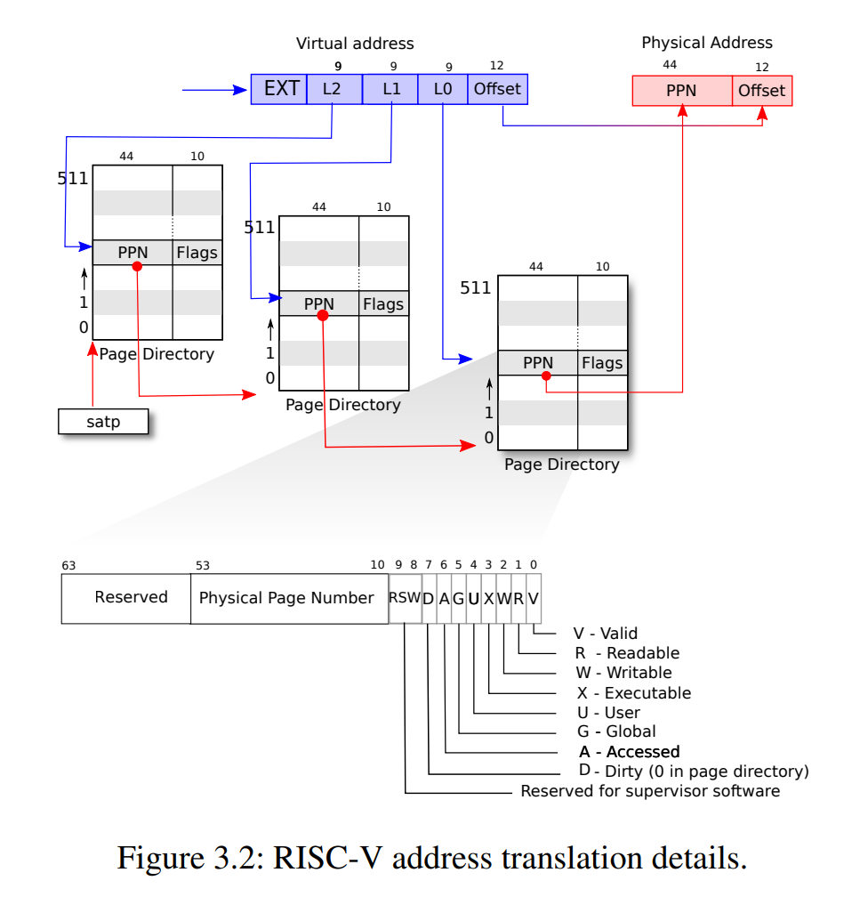

# [Lab3 page tables](https://pdos.csail.mit.edu/6.828/2020/labs/pgtbl.html)

[TOC]

## 1. Print a page table (easy)
### 1）实验目的
> Define a function called `vmprint()`. It should take a `pagetable_t` argument, and print that pagetable in the format described below. Insert if`(p->pid==1) vmprint(p->pagetable)` in exec.c just before the `return argc`, to print the first process's page table. You receive full credit for this assignment if you pass the `pte printout` test of `make grade`.
> 定义一个叫做`vmprint()`的函数。它应该接受一个`pagetable_t`类型的参数，并以下面描述的格式打印该`pagetable`。在`exec.c`中插入`if(p->pid==1) vmprint(p->pagetable)`，就在返回`argc`之前，以打印第一个进程的页表。如果你通过了`make grade`的`pte printout`测试，你会收到这个任务的满分。

### 2）实验步骤
#### 编写代码
参考`freewalk()`函数，在`kernel/vm.c`文件中实现`vmprint()`函数
```c
// vmprint的实现 lab3-1
void vmprint_helper(pagetable_t pagetable, int level) {
  // there are 2^9 = 512 PTEs in a page table.
  for(int i = 0; i < 512; i++){
    pte_t pte = pagetable[i];
    if (pte & PTE_V) {
      for (int j = 0; j < level; ++j) {
        printf("..");
        if (j != level - 1)
          printf(" ");
      }
      uint64 child = PTE2PA(pte);
      printf("%d: pte %p pa %p\n", i, pte, child);

      if ((pte & (PTE_R | PTE_W | PTE_X)) == 0)
        vmprint_helper((pagetable_t)child, level + 1);
    }
  }
}

void vmprint(pagetable_t pagetable) {
  printf("page table %p\n", pagetable);
  vmprint_helper(pagetable, 1);
}
```

在`kernel/defs.h`文件中添加函数定义

````C
void vmprint(pagetable_t);
````

在`kernel/exec.c`文件中`exec()`函数调用`vmprint()`函数
```c
int
exec(char *path, char **argv)
{
  ...
  p->trapframe->sp = sp; // initial stack pointer
  proc_freepagetable(oldpagetable, oldsz);

  // 在返回argc之前调用vmprint lab3-1
  if (p->pid == 1)
    vmprint(p->pagetable);

  return argc; // this ends up in a0, the first argument to main(argc, argv)
  ...
}
```

#### 测试程序
进入QEMU模拟器
```bash
$ make qemu
```
就可以看到在boot的时候打印出来的页表结果
```bash
xv6 kernel is booting

hart 2 starting
hart 1 starting
page table 0x0000000087f6e000
..0: pte 0x0000000021fda801 pa 0x0000000087f6a000
.. ..0: pte 0x0000000021fda401 pa 0x0000000087f69000
.. .. ..0: pte 0x0000000021fdac1f pa 0x0000000087f6b000
.. .. ..1: pte 0x0000000021fda00f pa 0x0000000087f68000
.. .. ..2: pte 0x0000000021fd9c1f pa 0x0000000087f67000
..255: pte 0x0000000021fdb401 pa 0x0000000087f6d000
.. ..511: pte 0x0000000021fdb001 pa 0x0000000087f6c000
.. .. ..510: pte 0x0000000021fdd807 pa 0x0000000087f76000
.. .. ..511: pte 0x0000000020001c0b pa 0x0000000080007000
init: starting sh
```

> Explain the output of `vmprint` in terms of Fig 3-4 from the text. What does page 0 contain? What is in page 2? When running in user mode, could the process read/write the memory mapped by page 1?
> 
page0对应程序的代码段和数据段，page2则对应用户栈，中间的page1是guard page，因此也不能用于映射

键入`Ctrl+a`，松开，然后键入`x`，退出xv6系统，并进行单元测试

```bash
root@LAPTOP-UER420HO:~/xv6-labs-2020# ./grade-lab-pgtbl pte
make: 'kernel/kernel' is up to date.
== Test pte printout == pte printout: OK (1.0s) 
```
### 3）实验中遇到的问题和解决方法
调用`_vmprint((pagetable_t)pa, level+1);`忘记对`pa`变量进行类型转换而导致报错
这里编译器并不允许隐式的类型转换，虽然它们都是uint64，但定义了不同的类型就不能隐式转换，需要显式地将物理地址转换为`pagetable_t`
### 4）实验心得
本次实验较为简单，比较困难的地方在于对于页表相关知识的理解。
在xv6系统中，使用的是RISC-V的三级页表，每级页表为一个页即4KB，其中包含512个PTE(page table entity)，低10位为标志位，低8位已经占用，剩下两位保留位
而虚拟地址中有27位作为页号索引，从高到低以9位区分分别对应每一级页表，这里的9位就对应着512个PTE

不同标志位的定义可以在`kernel/riscv.h`文件中找到，我们可以通过这些标志位判断`pte`是否有效、可读写等等
同时，为了找到第一级页表，该机制为每个CPU都设置了一个`SATP`寄存器，存储第一级页表的物理地址，即一级页表的首地址

对于一次三级页表的查询过程，我们从`SATP`寄存器得到一级页表的首地址，然后通过虚拟地址中`L2`项确定一级页表的首地址偏移量找到第几项，找到该项后，通过`PTE2PA()`函数转换为物理地址
在`kernel/riscv.h`文件中可以找到该函数的定义
```c
#define PTE2PA(pte) (((pte) >> 10) << 12)
```
其中的含义为，将低10位的标志位去掉，然后左移12位用0填充作为offset，从而得到下一级页表的首地址，再与虚拟地址中的`L1`项相加，作用于offset那12位，得到该页表中`pte`的地址
以此类推从而最终找到物理页面

对于本次实验，我们需要遍历页表中的每一个有效的PTE，并且将PTE转换成物理地址`pa`并答应出来
若是满足`pte & (PTE_R | PTE_W | PTE_X) == 0`条件，说明该`pte`不可读或不可写或不可执行，即为指向下一级页表，进入递归函数
## 2. A kernel page table per process (hard)
### 1）实验目的
> Your first job is to modify the kernel so that every process uses its own copy of the kernel page table when executing in the kernel. Modify `struct proc` to maintain a kernel page table for each process, and modify the scheduler to switch kernel page tables when switching processes. For this step, each per-process kernel page table should be identical to the existing global kernel page table. You pass this part of the lab if `usertests` runs correctly.
> 您的第一项工作是修改内核，以便每个进程在内核中执行时都使用自己的内核页表副本。修改`struct proc`为每个进程维护一个内核页表，并修改调度器以在切换进程时切换内核页表。对于这一步，每个进程的内核页面表应该与现有的全局内核页面表相同。如果`usertests`运行正确，您就通过了实验的这一部分。
### 2）实验步骤
#### 编写代码
在`kernel/proc.h`文件中给`struct proc`结构体添加内核页表数据成员
```c
struct proc {
  ...
  char name[16];               // Process name (debugging)
  // 添加内核页表 lab3-2
  pagetable_t kpagetable;
};
```
在`kernel/vm.c`文件中实现对每个进程的内核页表的初始化函数，参考`kvminit()`和`mappages()`函数的功能
同时记得添加头文件，并且要注意头文件顺序
```c
// lab3-2
#include "spinlock.h"
#include "proc.h"
...
// 初始化kernel页表 lab3-2
pagetable_t _kvminit() {
  pagetable_t pgtbl = uvmcreate();
  _kvmmap(pgtbl, UART0, UART0, PGSIZE, PTE_R | PTE_W);
  _kvmmap(pgtbl, VIRTIO0, VIRTIO0, PGSIZE, PTE_R | PTE_W);
  _kvmmap(pgtbl, CLINT, CLINT, 0x10000, PTE_R | PTE_W);
  _kvmmap(pgtbl, PLIC, PLIC, 0x400000, PTE_R | PTE_W);
  _kvmmap(pgtbl, KERNBASE, KERNBASE, (uint64)etext-KERNBASE, PTE_R | PTE_X);
  _kvmmap(pgtbl, (uint64)etext, (uint64)etext, PHYSTOP-(uint64)etext, PTE_R | PTE_W);
  _kvmmap(pgtbl, TRAMPOLINE, (uint64)trampoline, PGSIZE, PTE_R | PTE_X);
  return pgtbl;
}

void _kvmmap(pagetable_t pagetable, uint64 va, uint64 pa, uint64 sz, int perm) {
  if(mappages(pagetable, va, sz, pa, perm) != 0)
    panic("_kvmmap");
}
```
修改`kernel/vm.c`原来的`kvminit()`函数，调用`_kvminit()`完成对全局内核页表的初始化
```c
void
kvminit()
{
  // kernel_pagetable = (pagetable_t) kalloc();
  // memset(kernel_pagetable, 0, PGSIZE);

  // // uart registers
  // kvmmap(UART0, UART0, PGSIZE, PTE_R | PTE_W);

  // // virtio mmio disk interface
  // kvmmap(VIRTIO0, VIRTIO0, PGSIZE, PTE_R | PTE_W);

  // // CLINT
  // kvmmap(CLINT, CLINT, 0x10000, PTE_R | PTE_W);

  // // PLIC
  // kvmmap(PLIC, PLIC, 0x400000, PTE_R | PTE_W);

  // // map kernel text executable and read-only.
  // kvmmap(KERNBASE, KERNBASE, (uint64)etext-KERNBASE, PTE_R | PTE_X);

  // // map kernel data and the physical RAM we'll make use of.
  // kvmmap((uint64)etext, (uint64)etext, PHYSTOP-(uint64)etext, PTE_R | PTE_W);

  // // map the trampoline for trap entry/exit to
  // // the highest virtual address in the kernel.
  // kvmmap(TRAMPOLINE, (uint64)trampoline, PGSIZE, PTE_R | PTE_X);
  // 也可以用该函数初始化 lab3-2
  kernel_pagetable = _kvminit();
}
```

在`kernel/defs.h`中添加相应函数声明
```c
// lab3-1
void vmprint(pagetable_t);
// 初始化kernel页表 lab3-2
pagetable_t _kvminit();
// 映射
void _kvmmap(pagetable_t, uint64, uint64, uint64, int);
// vm.c的walk函数
pte_t* walk(pagetable_t, uint64, int);
```
在`kernel/proc.c`文件中修改`procinit()`函数和`allocproc()`函数，将其中对于内核栈`kstack`的初始化移动至`allocproc()`函数中
```c
void
procinit(void)
{
  struct proc *p;
  
  initlock(&pid_lock, "nextpid");
  for(p = proc; p < &proc[NPROC]; p++) {
      initlock(&p->lock, "proc");

      // Allocate a page for the process's kernel stack.
      // Map it high in memory, followed by an invalid
      // guard page.
      // 将该处处理移动到allocproc() lab3-2
      // char *pa = kalloc();
      // if(pa == 0)
      //   panic("kalloc");
      // uint64 va = KSTACK((int) (p - proc));
      // kvmmap(va, (uint64)pa, PGSIZE, PTE_R | PTE_W);
      // p->kstack = va;
  }
  kvminithart();
}

...

static struct proc*
allocproc(void)
{
  ...
found:
  ...

  // An empty user page table.
  p->pagetable = proc_pagetable(p);
  if(p->pagetable == 0){
    freeproc(p);
    release(&p->lock);
    return 0;
  }

  // 增加内核页表 lab3-2
  p->kpagetable = _kvminit();
  if (p->kpagetable == 0) {
    freeproc(p);
    release(&p->lock);
    return 0;
  }

  // 在此处初始化内核页表 lab3-2
  char* pa = kalloc();
  if (pa == 0)
    panic("kalloc");
  uint64 va = KSTACK((int)(p - proc));
  _kvmmap(p->kpagetable, va, (uint64)pa, PGSIZE, PTE_R | PTE_W);
  p->kstack = va;

  // Set up new context to start executing at forkret,
  // which returns to user space.
  memset(&p->context, 0, sizeof(p->context));
  p->context.ra = (uint64)forkret;
  p->context.sp = p->kstack + PGSIZE;

  return p;
}
```

在`kernel/proc.c`文件中修改`scheduler()`，切换进程的同时也要切换进程各自的内核页表，同时需要刷新快表
```c
void
scheduler(void)
{
    ...
    for(p = proc; p < &proc[NPROC]; p++) {
        ...
        p->state = RUNNING;
        c->proc = p;

        // 同时也要切换每个进程的内核页表 lab3-2
        w_satp(MAKE_SATP(p->kpagetable));
        // 刷新快表 lab3-2
        sfence_vma();

        swtch(&c->context, &p->context);

        // 切换回全局的内核页表 lab3-2
        kvminithart();

        // Process is done running for now.
        ...
      }
      release(&p->lock);
    ...
}
```

在`kernel/proc.c`文件中修改`freeproc()`函数，释放相应的内核栈和内核页表
参考第一个实验遍历页表的方式释放内核页表实现`proc_freekpagetable()`函数
```c
// 释放内核页表辅助递归函数 lab3-2
void proc_freekpagetable(pagetable_t kpagetable) {
  for (int i = 0; i < 512; ++i) {
    pte_t pte = kpagetable[i];
    if ((pte & PTE_V) && (pte & (PTE_R | PTE_W | PTE_X)) == 0) {
      uint64 child = PTE2PA(pte);
      proc_freekpagetable((pagetable_t)child);
      kpagetable[i] = 0;
    }
  }
  kfree((void*)kpagetable);
}

// free a proc structure and the data hanging from it,
// including user pages.
// p->lock must be held.
static void
freeproc(struct proc *p)
{
  if(p->trapframe)
    kfree((void*)p->trapframe);
  p->trapframe = 0;

  // 释放内核栈 lab3-2
  if (p->kstack) {
    pte_t* pte = walk(p->kpagetable, p->kstack, 0);
    if (pte == 0)
      panic("freeproc: kstack");
    kfree((void*)PTE2PA(*pte));
  }
  p->kstack = 0;

  if(p->pagetable)
    proc_freepagetable(p->pagetable, p->sz);
  p->pagetable = 0;

  // 释放内核页表 lab3-2
  if (p->kpagetable)
    proc_freekpagetable(p->kpagetable);
  p->kpagetable = 0;

  p->sz = 0;
  ...
}

```

在`kernel/vm.c`文件中修改`kvmpa()`，将全局内核页表转换成当前进程对应的内核页表
```c
uint64
kvmpa(uint64 va)
{
  ...
  uint64 pa;
  // 使用进程自己的内核页表
  pte = walk(myproc()->kpagetable, va, 0);
  ...
}
```

#### 测试程序
进入QEMU模拟器
```bash
$ make qemu
```
键入`usertests`进行测试
```bash
$ usertests
usertests starting
test execout: OK
test copyin: OK
test copyout: OK
test copyinstr1: OK
test copyinstr2: OK
test copyinstr3: OK
test truncate1: OK
test truncate2: OK
test truncate3: OK
test reparent2: OK
test pgbug: OK
test sbrkbugs: usertrap(): unexpected scause 0x000000000000000c pid=3234
            sepc=0x0000000000005406 stval=0x0000000000005406
usertrap(): unexpected scause 0x000000000000000c pid=3235
            sepc=0x0000000000005406 stval=0x0000000000005406
OK
test badarg: OK
test reparent: OK
test twochildren: OK
test forkfork: OK
test forkforkfork: OK
test argptest: OK
test createdelete: OK
test linkunlink: OK
test linktest: OK
test unlinkread: OK
test concreate: OK
test subdir: OK
test fourfiles: OK
test sharedfd: OK
test exectest: OK
test bigargtest: OK
test bigwrite: OK
test bsstest: OK
test sbrkbasic: OK
test sbrkmuch: OK
test kernmem: usertrap(): unexpected scause 0x000000000000000d pid=6214
            sepc=0x000000000000201a stval=0x0000000080000000
usertrap(): unexpected scause 0x000000000000000d pid=6215
            sepc=0x000000000000201a stval=0x000000008000c350
usertrap(): unexpected scause 0x000000000000000d pid=6216
            sepc=0x000000000000201a stval=0x00000000800186a0
usertrap(): unexpected scause 0x000000000000000d pid=6217
            sepc=0x000000000000201a stval=0x00000000800249f0
usertrap(): unexpected scause 0x000000000000000d pid=6218
            sepc=0x000000000000201a stval=0x0000000080030d40
usertrap(): unexpected scause 0x000000000000000d pid=6219
            sepc=0x000000000000201a stval=0x000000008003d090
usertrap(): unexpected scause 0x000000000000000d pid=6220
            sepc=0x000000000000201a stval=0x00000000800493e0
usertrap(): unexpected scause 0x000000000000000d pid=6221
            sepc=0x000000000000201a stval=0x0000000080055730
usertrap(): unexpected scause 0x000000000000000d pid=6222
            sepc=0x000000000000201a stval=0x0000000080061a80
usertrap(): unexpected scause 0x000000000000000d pid=6223
            sepc=0x000000000000201a stval=0x000000008006ddd0
usertrap(): unexpected scause 0x000000000000000d pid=6224
            sepc=0x000000000000201a stval=0x000000008007a120
usertrap(): unexpected scause 0x000000000000000d pid=6225
            sepc=0x000000000000201a stval=0x0000000080086470
usertrap(): unexpected scause 0x000000000000000d pid=6226
            sepc=0x000000000000201a stval=0x00000000800927c0
usertrap(): unexpected scause 0x000000000000000d pid=6227
            sepc=0x000000000000201a stval=0x000000008009eb10
usertrap(): unexpected scause 0x000000000000000d pid=6228
            sepc=0x000000000000201a stval=0x00000000800aae60
usertrap(): unexpected scause 0x000000000000000d pid=6229
            sepc=0x000000000000201a stval=0x00000000800b71b0
usertrap(): unexpected scause 0x000000000000000d pid=6230
            sepc=0x000000000000201a stval=0x00000000800c3500
usertrap(): unexpected scause 0x000000000000000d pid=6231
            sepc=0x000000000000201a stval=0x00000000800cf850
usertrap(): unexpected scause 0x000000000000000d pid=6232
            sepc=0x000000000000201a stval=0x00000000800dbba0
usertrap(): unexpected scause 0x000000000000000d pid=6233
            sepc=0x000000000000201a stval=0x00000000800e7ef0
usertrap(): unexpected scause 0x000000000000000d pid=6234
            sepc=0x000000000000201a stval=0x00000000800f4240
usertrap(): unexpected scause 0x000000000000000d pid=6235
            sepc=0x000000000000201a stval=0x0000000080100590
usertrap(): unexpected scause 0x000000000000000d pid=6236
            sepc=0x000000000000201a stval=0x000000008010c8e0
usertrap(): unexpected scause 0x000000000000000d pid=6237
            sepc=0x000000000000201a stval=0x0000000080118c30
usertrap(): unexpected scause 0x000000000000000d pid=6238
            sepc=0x000000000000201a stval=0x0000000080124f80
usertrap(): unexpected scause 0x000000000000000d pid=6239
            sepc=0x000000000000201a stval=0x00000000801312d0
usertrap(): unexpected scause 0x000000000000000d pid=6240
            sepc=0x000000000000201a stval=0x000000008013d620
usertrap(): unexpected scause 0x000000000000000d pid=6241
            sepc=0x000000000000201a stval=0x0000000080149970
usertrap(): unexpected scause 0x000000000000000d pid=6242
            sepc=0x000000000000201a stval=0x0000000080155cc0
usertrap(): unexpected scause 0x000000000000000d pid=6243
            sepc=0x000000000000201a stval=0x0000000080162010
usertrap(): unexpected scause 0x000000000000000d pid=6244
            sepc=0x000000000000201a stval=0x000000008016e360
usertrap(): unexpected scause 0x000000000000000d pid=6245
            sepc=0x000000000000201a stval=0x000000008017a6b0
usertrap(): unexpected scause 0x000000000000000d pid=6246
            sepc=0x000000000000201a stval=0x0000000080186a00
usertrap(): unexpected scause 0x000000000000000d pid=6247
            sepc=0x000000000000201a stval=0x0000000080192d50
usertrap(): unexpected scause 0x000000000000000d pid=6248
            sepc=0x000000000000201a stval=0x000000008019f0a0
usertrap(): unexpected scause 0x000000000000000d pid=6249
            sepc=0x000000000000201a stval=0x00000000801ab3f0
usertrap(): unexpected scause 0x000000000000000d pid=6250
            sepc=0x000000000000201a stval=0x00000000801b7740
usertrap(): unexpected scause 0x000000000000000d pid=6251
            sepc=0x000000000000201a stval=0x00000000801c3a90
usertrap(): unexpected scause 0x000000000000000d pid=6252
            sepc=0x000000000000201a stval=0x00000000801cfde0
usertrap(): unexpected scause 0x000000000000000d pid=6253
            sepc=0x000000000000201a stval=0x00000000801dc130
OK
test sbrkfail: usertrap(): unexpected scause 0x000000000000000d pid=6265
            sepc=0x0000000000003e7a stval=0x0000000000012000
OK
test sbrkarg: OK
test validatetest: OK
test stacktest: usertrap(): unexpected scause 0x000000000000000d pid=6269
            sepc=0x0000000000002188 stval=0x000000000000fbc0
OK
test opentest: OK
test writetest: OK
test writebig: OK
test createtest: OK
test openiput: OK
test exitiput: OK
test iput: OK
test mem: OK
test pipe1: OK
test preempt: kill... wait... OK
test exitwait: OK
test rmdot: OK
test fourteen: OK
test bigfile: OK
test dirfile: OK
test iref: OK
test forktest: OK
test bigdir: OK
ALL TESTS PASSED
```
### 3）实验中遇到的问题和解决方法
#### kerneltrap
```c
scause 0x000000000000000d
sepc=0x0000000080001072 stval=0x00000000000007f8
panic: kerneltrap
```
`procalloc`中忘记增加各自进程的内核页表的初始化
```c
// 增加内核页表
p->kpagetable = _kvminit();
```
#### 测试卡住了
```bash
$ usertests
usertests starting
test execout: OK
test copyin:
```
scheduler中没切换回全局的内核页表
### 4）实验心得
本次实验难度感觉大大提升，真实情况是跟着做做了好几遍也没对，这个实验和下面一个实验是所有实验做完后最后再做的的一个实验，大约做了四五次，在此感到能力大大提升！
#### 内核栈的初始化
本次实验主要就是要让每个进程都拥有一个独立的内核页表，到初始化映射都没什么问题，但对于为什么要把内核栈`kstack`的初始化从`procinit()`函数移动到`allocproc()`，这里有些许疑惑，最后在网上查询资料并结合源码，在此说一下自己的理解：因为`procinit()`是boot的时候就初始化整个系统的进程的的函数，内核栈`kstack`映射到的是全局内核页表`kernel_pagetable`；而这里要求每个进程都要有各自独立的页表，因此内核栈`kstack`也应该分别映射到各自的内核页表，`allocproc()`是从进程数组中找到一个可用的进程并初始化，是针对单个进程的初始化，因此需要移动到此处
#### walk函数
这个函数的作用比较难理解，它是在模拟分页硬件，找到虚拟地址中对应页表中的PTE然后，然后返回第一级页表的中的虚拟地址对应的PTE的地址
```c
pte_t *
walk(pagetable_t pagetable, uint64 va, int alloc)
{
  if(va >=MAXVA)
   panic("walk");
 
  for(intlevel = 2; level > 0; level--) {    /*处理了level=2和1*/
    pte_t*pte = &pagetable[PX(level, va)];
    if(*pte& PTE_V) {
     pagetable = (pagetable_t)PTE2PA(*pte);
    } else {
     if(!alloc || (pagetable = (pde_t*)kalloc()) == 0)
       return 0;
     memset(pagetable, 0, PGSIZE);
      *pte =PA2PTE(pagetable) | PTE_V;
    }
  }
  return &pagetable[PX(0, va)];   /* 返回0级 */
}
```
具体实现方法还得看`kernel/riscv.h`中对于`PX`的宏定义，查找了对应哪一级页表的对应页表首地址的偏移量
```c
// extract the three 9-bit page table indices from a virtual address.
#define PXMASK          0x1FF // 9 bits
#define PXSHIFT(level)  (PGSHIFT+(9*(level)))
#define PX(level, va) ((((uint64) (va)) >> PXSHIFT(level)) & PXMASK)
```

## 3. Simplify copyin/copyinstr (hard)
### 1）实验目的
> Replace the body of `copyin` in `kernel/vm.c` with a call to `copyin_new` (defined in `kernel/vmcopyin.c`); do the same for `copyinstr` and `copyinstr_new`. Add mappings for user addresses to each process's kernel page table so that `copyin_new` and `copyinstr_new` work. You pass this assignment if `usertests` runs correctly and all the `make grade` tests pass.
> 将`kernel/vm.c`中`copyin`的正文替换为对`copyin_new`的调用（在`kernel/vmcopyin.c`中定义）；对`copyinstr`和`copyinstr_new`执行相同操作。将用户地址的映射添加到每个进程的内核页表，以便`copyin_new`和`copyinstr_new`工作。如果`usertests`运行正确并且所有`make grade`测试都通过，则可以通过此作业。
### 2）实验步骤
#### 编写代码
在`kernel/vm.c`文件中实现`uvm2kvm()`函数
将进程中用户页表复制到内核页表
```c
// 用户页表复制到内核页表 lab3-3
void uvm2kvm(pagetable_t upagetable, pagetable_t kpagetable, uint64 src, uint64 dst) {
  if (src > PLIC)
    panic("uvm2kvm: src larger than PLIC");
  src = PGROUNDDOWN(src);
  for (uint64 i = src; i < dst; i += PGSIZE) {
    pte_t* pte_k = walk(kpagetable, i, 1);
    if (pte_k == 0)
      panic("uvm2kvm: kernel pagetable fails");
    pte_t* pte_u = walk(upagetable, i, 0);
    *pte_k = *pte_u;
    *pte_k &= ~PTE_U;
  }
}
```
在`kernel/vm.c`文件中修改`copyin()`和`copyinstr()`
```c
int
copyin(pagetable_t pagetable, char *dst, uint64 srcva, uint64 len)
{
  // uint64 n, va0, pa0;
  ...
  // return 0;
  return copyin_new(pagetable, dst, srcva, len);
}

int
copyinstr(pagetable_t pagetable, char *dst, uint64 srcva, uint64 max)
{
  // uint64 n, va0, pa0;
  ...
  // }
  return copyinstr_new(pagetable, dst, srcva, max);
}
```
修改系统调用`fork()`，使页表正确映射
```c
int
fork(void)
{
  ...
  np->sz = p->sz;

  // lab3-3
  uvm2kvm(np->pagetable, np->kpagetable, 0, np->sz);

  np->parent = p;

  ...
}
```
在`exec.c`中调用这个函数
```c
  // 在返回argc之前调用vmprint lab3-1
  if (p->pid == 1)
    vmprint(p->pagetable);

  // lab3-3
  uvm2kvm(p->pagetable, p->kpagetable, 0, p->sz);

  return argc; // this ends up in a0, the first argument to main(argc, argv)

```
`kernel/proc.c`文件中修改`userinit()
```c
void
userinit(void)
{
  ...
  p->sz = PGSIZE;

  // lab3-3
  uvm2kvm(p->pagetable, p->kpagetable, 0, p->sz);

  // prepare for the very first "return" from kernel to user.
  ...
}
```
在`kernel/defs.h`文件中添加相关函数声明
```c
// lab3-3
int copyin_new(pagetable_t, char*, uint64, uint64);
int copyinstr_new(pagetable_t, char*, uint64, uint64);
void uvm2kvm(pagetable_t, pagetable_t, uint64, uint64);
```
#### 测试程序
进入QEMU模拟器
```bash
$ make qemu
```
键入`usertests`进行测试
```bash
$ usertests
usertests starting
test execout: OK
test copyin: OK
test copyout: OK
test copyinstr1: OK
test copyinstr2: OK
test copyinstr3: OK
test truncate1: OK
test truncate2: OK
test truncate3: OK
test reparent2: OK
test pgbug: OK
test sbrkbugs: usertrap(): unexpected scause 0x000000000000000c pid=3234
            sepc=0x0000000000005406 stval=0x0000000000005406
usertrap(): unexpected scause 0x000000000000000c pid=3235
            sepc=0x0000000000005406 stval=0x0000000000005406
OK
test badarg: OK
test reparent: OK
test twochildren: OK
test forkfork: OK
test forkforkfork: OK
test argptest: OK
test createdelete: OK
test linkunlink: OK
test linktest: OK
test unlinkread: OK
test concreate: OK
test subdir: OK
test fourfiles: OK
test sharedfd: OK
test exectest: OK
test bigargtest: OK
test bigwrite: OK
test bsstest: OK
test sbrkbasic: OK
test sbrkmuch: OK
test kernmem: usertrap(): unexpected scause 0x000000000000000d pid=6214
            sepc=0x000000000000201a stval=0x0000000080000000
usertrap(): unexpected scause 0x000000000000000d pid=6215
            sepc=0x000000000000201a stval=0x000000008000c350
usertrap(): unexpected scause 0x000000000000000d pid=6216
            sepc=0x000000000000201a stval=0x00000000800186a0
usertrap(): unexpected scause 0x000000000000000d pid=6217
            sepc=0x000000000000201a stval=0x00000000800249f0
usertrap(): unexpected scause 0x000000000000000d pid=6218
            sepc=0x000000000000201a stval=0x0000000080030d40
usertrap(): unexpected scause 0x000000000000000d pid=6219
            sepc=0x000000000000201a stval=0x000000008003d090
usertrap(): unexpected scause 0x000000000000000d pid=6220
            sepc=0x000000000000201a stval=0x00000000800493e0
usertrap(): unexpected scause 0x000000000000000d pid=6221
            sepc=0x000000000000201a stval=0x0000000080055730
usertrap(): unexpected scause 0x000000000000000d pid=6222
            sepc=0x000000000000201a stval=0x0000000080061a80
usertrap(): unexpected scause 0x000000000000000d pid=6223
            sepc=0x000000000000201a stval=0x000000008006ddd0
usertrap(): unexpected scause 0x000000000000000d pid=6224
            sepc=0x000000000000201a stval=0x000000008007a120
usertrap(): unexpected scause 0x000000000000000d pid=6225
            sepc=0x000000000000201a stval=0x0000000080086470
usertrap(): unexpected scause 0x000000000000000d pid=6226
            sepc=0x000000000000201a stval=0x00000000800927c0
usertrap(): unexpected scause 0x000000000000000d pid=6227
            sepc=0x000000000000201a stval=0x000000008009eb10
usertrap(): unexpected scause 0x000000000000000d pid=6228
            sepc=0x000000000000201a stval=0x00000000800aae60
usertrap(): unexpected scause 0x000000000000000d pid=6229
            sepc=0x000000000000201a stval=0x00000000800b71b0
usertrap(): unexpected scause 0x000000000000000d pid=6230
            sepc=0x000000000000201a stval=0x00000000800c3500
usertrap(): unexpected scause 0x000000000000000d pid=6231
            sepc=0x000000000000201a stval=0x00000000800cf850
usertrap(): unexpected scause 0x000000000000000d pid=6232
            sepc=0x000000000000201a stval=0x00000000800dbba0
usertrap(): unexpected scause 0x000000000000000d pid=6233
            sepc=0x000000000000201a stval=0x00000000800e7ef0
usertrap(): unexpected scause 0x000000000000000d pid=6234
            sepc=0x000000000000201a stval=0x00000000800f4240
usertrap(): unexpected scause 0x000000000000000d pid=6235
            sepc=0x000000000000201a stval=0x0000000080100590
usertrap(): unexpected scause 0x000000000000000d pid=6236
            sepc=0x000000000000201a stval=0x000000008010c8e0
usertrap(): unexpected scause 0x000000000000000d pid=6237
            sepc=0x000000000000201a stval=0x0000000080118c30
usertrap(): unexpected scause 0x000000000000000d pid=6238
            sepc=0x000000000000201a stval=0x0000000080124f80
usertrap(): unexpected scause 0x000000000000000d pid=6239
            sepc=0x000000000000201a stval=0x00000000801312d0
usertrap(): unexpected scause 0x000000000000000d pid=6240
            sepc=0x000000000000201a stval=0x000000008013d620
usertrap(): unexpected scause 0x000000000000000d pid=6241
            sepc=0x000000000000201a stval=0x0000000080149970
usertrap(): unexpected scause 0x000000000000000d pid=6242
            sepc=0x000000000000201a stval=0x0000000080155cc0
usertrap(): unexpected scause 0x000000000000000d pid=6243
            sepc=0x000000000000201a stval=0x0000000080162010
usertrap(): unexpected scause 0x000000000000000d pid=6244
            sepc=0x000000000000201a stval=0x000000008016e360
usertrap(): unexpected scause 0x000000000000000d pid=6245
            sepc=0x000000000000201a stval=0x000000008017a6b0
usertrap(): unexpected scause 0x000000000000000d pid=6246
            sepc=0x000000000000201a stval=0x0000000080186a00
usertrap(): unexpected scause 0x000000000000000d pid=6247
            sepc=0x000000000000201a stval=0x0000000080192d50
usertrap(): unexpected scause 0x000000000000000d pid=6248
            sepc=0x000000000000201a stval=0x000000008019f0a0
usertrap(): unexpected scause 0x000000000000000d pid=6249
            sepc=0x000000000000201a stval=0x00000000801ab3f0
usertrap(): unexpected scause 0x000000000000000d pid=6250
            sepc=0x000000000000201a stval=0x00000000801b7740
usertrap(): unexpected scause 0x000000000000000d pid=6251
            sepc=0x000000000000201a stval=0x00000000801c3a90
usertrap(): unexpected scause 0x000000000000000d pid=6252
            sepc=0x000000000000201a stval=0x00000000801cfde0
usertrap(): unexpected scause 0x000000000000000d pid=6253
            sepc=0x000000000000201a stval=0x00000000801dc130
OK
test sbrkfail: usertrap(): unexpected scause 0x000000000000000d pid=6265
            sepc=0x0000000000003e7a stval=0x0000000000012000
OK
test sbrkarg: OK
test validatetest: OK
test stacktest: usertrap(): unexpected scause 0x000000000000000d pid=6269
            sepc=0x0000000000002188 stval=0x000000000000fbc0
OK
test opentest: OK
test writetest: OK
test writebig: OK
test createtest: OK
test openiput: OK
test exitiput: OK
test iput: OK
test mem: OK
test pipe1: OK
test preempt: kill... wait... OK
test exitwait: OK
test rmdot: OK
test fourteen: OK
test bigfile: OK
test dirfile: OK
test iref: OK
test forktest: OK
test bigdir: OK
ALL TESTS PASSED
$ 
```

键入`Ctrl+a`，松开，然后键入`x`，退出xv6系统，并进行单元测试
```bash
root@LAPTOP-UER420HO:~/xv6-labs-2020# ./grade-lab-pgtbl 
make: 'kernel/kernel' is up to date.
== Test pte printout == pte printout: OK (1.5s) 
== Test answers-pgtbl.txt == answers-pgtbl.txt: OK 
== Test count copyin == count copyin: OK (0.9s) 
== Test usertests == (98.6s) 
== Test   usertests: copyin == 
  usertests: copyin: OK 
== Test   usertests: copyinstr1 == 
  usertests: copyinstr1: OK 
== Test   usertests: copyinstr2 == 
  usertests: copyinstr2: OK 
== Test   usertests: copyinstr3 == 
  usertests: copyinstr3: OK 
== Test   usertests: sbrkmuch == 
  usertests: sbrkmuch: OK 
== Test   usertests: all tests == 
  usertests: all tests: OK 
== Test time == 
time: OK 
Score: 66/66
```
#### 讨论
> Explain why the third test `srcva + len < srcva` is necessary in copyin_new(): give values for `srcva` and `len` for which the first two test fail (i.e., they will not cause to return -1) but for which the third one is true (resulting in returning -1).

`srcva`为0x10，`len`为`0xffff...ffff`时，满足`srcva >= p->sz`，`srcva + len >= p->sz`，但`srcva + len`溢出，小于srcva，便可以检测到溢出

### 3）实验中遇到的问题和解决方法
囫囵吞枣地看了一下就开始做实验了，发现还是会有很多卡壳的地方
仔细看书，将每个细节都理解好了才能开始做实验，从而知道每一步自己都在干什么

### 4）实验心得
在`kernel/vm.c`文件中实现`uvm2kvm()`函数
将进程中用户页表复制到内核页表。这个函数只是复制了`p->pagetable`的物理地址，并没有申请新的空间，因此，复制的结果是`p->pagetable`和`p->kpagetable`共享同一个物理地址。同时，对于去掉标志位`PTE_U`、`PTE_W`、`PTE_X`是因为内核需要对该页表进行读，但`PTE_U`规定只能由用户访问，因此需要去掉；因为没必要修改，所以也去掉`PTE_W`、`PTE_X`
