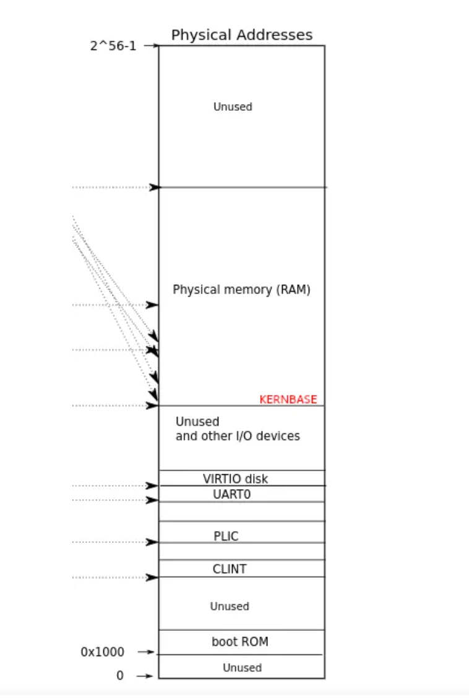

# [Lab6 Copy-on-Write Fork for xv6](https://pdos.csail.mit.edu/6.828/2020/labs/cow.html)

[TOC]

虚拟内存提供一定程度的间接性：内核可以通过将PTE标记为无效或只读来截获内存引用，导致页面错误，并且可以通过修改PTE来更改地址的含义。计算机系统中有一种说法，任何系统问题都可能是通过一定程度的间接解决。惰性分配实验室提供了一个例。本实验探讨了另一个示例：`COW fork()`

xv6中的`fork()`系统调用复制了所有父进程的用户空间内存给子级。如果父进程的页面很大，复制可以需要很长时间。更糟糕的是，这个操作往往在很大程度上被浪费了；例如子项中的`fork()`后跟`exec()`将导致子项直接丢弃复制的很多都没使用过的内存。另一方面，如果父进程和子进程都使用一个页面，并且其中一个或两个都写入，这种情况下确实需要副本

**解决方法**
`COW fork()`的目标是延迟分配和需要的时候才给子进程复制物理内存页面

`COW fork()`只为子进程创建**一个页表**，用户内存的PTE指向父进程的物理页。`COW fork()`将父进程和子进程中的所有用户PTE标记为不可写。当任一进程试图写入其中一个COW页时，**CPU将强制产生页面错误**。内核页面错误处理程序检测到这种情况**将为出错进程分配一页物理内存**，将原始页复制到新页中，并修改出错进程中的相关PTE指向新的页面，将PTE标记为可写。当页面错误处理程序返回时，用户进程将能够写入其页面副本。

`COW fork()`将使得释放用户内存的物理页面变得更加棘手。给定的物理页可能会被多个进程的页表引用，并且**只有在最后一个引用消失时才应该被释放**。

## 1. Implement copy-on write(hard)
### 1）实验目的
> Your task is to implement copy-on-write fork in the xv6 kernel. You are done if your modified kernel executes both the cowtest and usertests programs successfully.
> 您的任务是在xv6内核中实现copy-on-write fork。如果修改后的内核同时成功执行`cowtest`和`usertests`程序就完成了。
### 2）实验步骤
#### 编写代码
设置COW标记位，从而可以区分一般的的page fault和COW引发的页面错误
利用PTE中保留某个比特位设置即可
在`kernel/riscv.h`文件中添加
```c
// lab6
#define PTE_COW (1L << 8)
```
我们增加一个数据结构帮助处理页面使用的计数
并且添加计数增加和减少的方法
注意其中需要利用自旋锁，从而实现进程间的互斥
在`kernel/defs.h`增添这两个函数的声明
```c
// lab6
void add_cnt(uint64);
uint8 sub_cnt(uint64);
```
在Makefile中添加`$K/cow.o'
```makefile
  ...
  $K/virtio_disk.o \
  $K/cow.o
  ...
```
新建`kernel/cow.c`文件，实现上述操作
```c
#include "types.h"
#include "memlayout.h"
#include "spinlock.h"
#include "riscv.h"
#include "defs.h"

// 计数结构
struct {
    uint8 cnt;
    struct spinlock lock;
    //12 就是页面大小
} cow[(PHYSTOP - KERNBASE) >> 12];

// 增加
void add_cnt(uint64 pa) {
    if (pa < KERNBASE)
        return;
    
    pa = (pa - KERNBASE) >> 12;
    acquire(&cow[pa].lock);
    ++cows[pa].cnt;
    release(&cow[pa].lock);
}

// 减少 需要返回判断是否为零
uint8 sub_cnt(uint64 pa) {
    uint8 ans;
    if (pa < KERNBASE)
        return 0;
    pa = (pa - KERNBASE) >> 12;
    acquire(&cow[pa].lock);
    ans = --cow[pa].cnt;
    release(&cow[pa].lock);
    return ans;
}
```
使用`fork()`函数创建子进程的时候，其中调用`uvmcopy()`函数将父进程的用户页表复制到子进程中。在COW中，不会复制，而是将子进程虚拟页同样映射在与父进程相同的物理页上
因此，我们需要将写标志位 `PTE_W`移除，添加COW标志位 `PTE_COW`
修改`kernel/vm.c`文件中的`uvmcopy()`函数
```c
int
uvmcopy(pagetable_t old, pagetable_t new, uint64 sz)
{
  pte_t *pte;
  uint64 pa, i;
  uint flags;
  // 不分配实际物理内存lab6
  // char *mem;

  for(i = 0; i < sz; i += PGSIZE){
    if((pte = walk(old, i, 0)) == 0)
      panic("uvmcopy: pte should exist");
    if((*pte & PTE_V) == 0)
      panic("uvmcopy: page not present");
    pa = PTE2PA(*pte);

    // 清除PTE_W标志位 增加COW标志位lab6
    flags = PTE_FLAGS(*pte & (~PTE_W)) | PTE_COW;
    *pte = PA2PTE(pa) | flags;

    // 不分配实际物理内存lab6
    // if((mem = kalloc()) == 0)
    //   goto err;
    // memmove(mem, (char*)pa, PGSIZE);
    if(mappages(new, i, PGSIZE, pa, flags) != 0){
    //   kfree(mem);
      goto err;
    }
    // 计数增加
    add_cnt(pa);
  }
  return 0;

 err:
  uvmunmap(new, 0, i / PGSIZE, 1);
  return -1;
}
```

修改usertrap()和copyout()函数，两处的写入的页面错误错误均需要进行相同的操作，于是我们参考`walkaddr()`在`kernel/vm.c`文件中添加一个函数`walkcowaddr()`
```c
uint64 walkcowaddr(pagetable_t pagetable, uint64 va) {
  uint64 pa;
  char* mem;
  pte_t* pte;
  uint flag;

  // 判断范围
  if (va >= MAXVA)
    return 0;
  // 找到虚拟地址对应的pte
  pte = walk(pagetable, va, 0);
  if (pte == 0 || (*pte & PTE_V) == 0 || (*pte & PTE_U) == 0)
    return 0;
  pa = PTE2PA(*pte);
  if ((*pte & PTE_W) == 0) {
    if ((*pte & PTE_COW) == 0)
      return 0;
    // 分配新的物理内存
    if ((mem = kalloc()) == 0)
      return 0;
    // 复制页表内容
    memmove(mem, (void*)pa, PGSIZE);
    // 取消COW标志位变为写标志
    flag = (PTE_FLAGS(*pte) & (~PTE_COW)) | PTE_W;

    // 取消原来的映射 映射到新分配的物理内存
    uvmunmap(pagetable, PGROUNDDOWN(va), 1, 1);
    if (mappages(pagetable, PGROUNDDOWN(va), PGSIZE, (uint64)mem, flag) != 0) {
      kfree(mem);
      return 0;
    }
    return (uint64)mem;
  }
  return pa;
}
```

在`kernel/proc.c`文件中`usertrap()`函数中调用上述`walkcowaddr()`
```c
void
usertrap(void)
{
  ...
  if(r_scause() == 8){
    ...
  }
  // 写页面错误 lab6
  else if (r_scause() == 15) {
    uint64 va = r_stval();
    if (walkcowaddr(p->pagetable, va) == 0) {
      goto end;
    }
  }
  else if((which_dev = devintr()) != 0){
    // ok
  } else {
    // lab6
end:
    printf("usertrap(): unexpected scause %p pid=%d\n", r_scause(), p->pid);
    printf("            sepc=%p stval=%p\n", r_sepc(), r_stval());
    p->killed = 1;
  }

  if(p->killed)
    exit(-1);
  ...
}
```
在`kernel/vm.c`文件中`copyout()`函数中调用上述`walkcowaddr()`
```c
int
copyout(pagetable_t pagetable, uint64 dstva, char *src, uint64 len)
{
  uint64 n, va0, pa0;

  while(len > 0){
    va0 = PGROUNDDOWN(dstva);
    // pa0 = walkaddr(pagetable, va0);
    pa0 = walkcowaddr(pagetable, va0);
    if(pa0 == 0)
      return -1;
    ...
  }
  return 0;
}
```

修改`kernel/kalloc.c`中的`kalloc()`函数
这里将一个物理页面分配给一个进程，计数增加
```c
void *
kalloc(void)
{
  struct run *r;

  acquire(&kmem.lock);
  r = kmem.freelist;
  if(r)
    kmem.freelist = r->next;
  release(&kmem.lock);
  // 计数增加 lab6
  add_cnt((uint64)r);
  if(r)
    memset((char*)r, 5, PGSIZE); // fill with junk
  return (void*)r;
}
```
修改`kernel/kalloc.c`中的`kalloc()`函数
这里负责释放一个页面，计数减少，并且需要判断是否减少为零，计数为零才真正释放物理页面
```c
void
kfree(void *pa)
{
  struct run *r;

  if(((uint64)pa % PGSIZE) != 0 || (char*)pa < end || (uint64)pa >= PHYSTOP)
    panic("kfree");
  // 计数减少lab6 不为零直接退出不用释放物理页面
  if (sub_cnt((uint64)pa))
    return;
  // Fill with junk to catch dangling refs.
  memset(pa, 1, PGSIZE);
  ...
}
```
修改`kernel/kalloc.c`文件中的 `freerange()`函数
这里负责把空闲物理页面送给`kfree()`调用，这里需要先计数增加，保证第一次引用减少后不会越界，同时也刚好可以正常计数
```c
void
freerange(void *pa_start, void *pa_end)
{
  char *p;
  p = (char*)PGROUNDUP((uint64)pa_start);
  for(; p + PGSIZE <= (char*)pa_end; p += PGSIZE) {
    // 先增加计数lab6
    add_cnt((uint64)p);
    kfree(p);
  }
}
```
#### 测试程序
在存放`Makefile`文件的目录下执行如下命令
```bash
$ make qemu
```
启动xv6系统 QEMU模拟器
键入指令`cowtest`进行测试
```bash
$ cowtest
simple: ok
simple: ok
three: ok
three: ok
three: ok
file: ok
ALL COW TESTS PASSED
```
测试通过
键入指令`usertests`进行测试
```bash
$ usertests
usertests starting
test execout: usertrap(): unexpected scause 0x000000000000000f pid=6
            sepc=0x0000000000002ac0 stval=0x0000000000010b88
OK
test copyin: OK
test copyout: OK
test copyinstr1: OK
test copyinstr2: OK
test copyinstr3: OK
test rwsbrk: OK
test truncate1: OK
test truncate2: OK
test truncate3: OK
test reparent2: OK
test pgbug: OK
test sbrkbugs: usertrap(): unexpected scause 0x000000000000000c pid=3235
            sepc=0x000000000000555e stval=0x000000000000555e
usertrap(): unexpected scause 0x000000000000000c pid=3236
            sepc=0x000000000000555e stval=0x000000000000555e
OK
test badarg: OK
test reparent: OK
test twochildren: OK
test forkfork: OK
test forkforkfork: OK
test argptest: OK
test createdelete: OK
test linkunlink: OK
test linktest: OK
test unlinkread: OK
test concreate: OK
test subdir: OK
test fourfiles: OK
test sharedfd: OK
test dirtest: OK
test exectest: OK
test bigargtest: OK
test bigwrite: OK
test bsstest: OK
test sbrkbasic: OK
test sbrkmuch: OK
test kernmem: usertrap(): unexpected scause 0x000000000000000d pid=6216
            sepc=0x0000000000002026 stval=0x0000000080000000
usertrap(): unexpected scause 0x000000000000000d pid=6217
            sepc=0x0000000000002026 stval=0x000000008000c350
usertrap(): unexpected scause 0x000000000000000d pid=6218
            sepc=0x0000000000002026 stval=0x00000000800186a0
usertrap(): unexpected scause 0x000000000000000d pid=6219
            sepc=0x0000000000002026 stval=0x00000000800249f0
usertrap(): unexpected scause 0x000000000000000d pid=6220
            sepc=0x0000000000002026 stval=0x0000000080030d40
usertrap(): unexpected scause 0x000000000000000d pid=6221
            sepc=0x0000000000002026 stval=0x000000008003d090
usertrap(): unexpected scause 0x000000000000000d pid=6222
            sepc=0x0000000000002026 stval=0x00000000800493e0
usertrap(): unexpected scause 0x000000000000000d pid=6223
            sepc=0x0000000000002026 stval=0x0000000080055730
usertrap(): unexpected scause 0x000000000000000d pid=6224
            sepc=0x0000000000002026 stval=0x0000000080061a80
usertrap(): unexpected scause 0x000000000000000d pid=6225
            sepc=0x0000000000002026 stval=0x000000008006ddd0
usertrap(): unexpected scause 0x000000000000000d pid=6226
            sepc=0x0000000000002026 stval=0x000000008007a120
usertrap(): unexpected scause 0x000000000000000d pid=6227
            sepc=0x0000000000002026 stval=0x0000000080086470
usertrap(): unexpected scause 0x000000000000000d pid=6228
            sepc=0x0000000000002026 stval=0x00000000800927c0
usertrap(): unexpected scause 0x000000000000000d pid=6229
            sepc=0x0000000000002026 stval=0x000000008009eb10
usertrap(): unexpected scause 0x000000000000000d pid=6230
            sepc=0x0000000000002026 stval=0x00000000800aae60
usertrap(): unexpected scause 0x000000000000000d pid=6231
            sepc=0x0000000000002026 stval=0x00000000800b71b0
usertrap(): unexpected scause 0x000000000000000d pid=6232
            sepc=0x0000000000002026 stval=0x00000000800c3500
usertrap(): unexpected scause 0x000000000000000d pid=6233
            sepc=0x0000000000002026 stval=0x00000000800cf850
usertrap(): unexpected scause 0x000000000000000d pid=6234
            sepc=0x0000000000002026 stval=0x00000000800dbba0
usertrap(): unexpected scause 0x000000000000000d pid=6235
            sepc=0x0000000000002026 stval=0x00000000800e7ef0
usertrap(): unexpected scause 0x000000000000000d pid=6236
            sepc=0x0000000000002026 stval=0x00000000800f4240
usertrap(): unexpected scause 0x000000000000000d pid=6237
            sepc=0x0000000000002026 stval=0x0000000080100590
usertrap(): unexpected scause 0x000000000000000d pid=6238
            sepc=0x0000000000002026 stval=0x000000008010c8e0
usertrap(): unexpected scause 0x000000000000000d pid=6239
            sepc=0x0000000000002026 stval=0x0000000080118c30
usertrap(): unexpected scause 0x000000000000000d pid=6240
            sepc=0x0000000000002026 stval=0x0000000080124f80
usertrap(): unexpected scause 0x000000000000000d pid=6241
            sepc=0x0000000000002026 stval=0x00000000801312d0
usertrap(): unexpected scause 0x000000000000000d pid=6242
            sepc=0x0000000000002026 stval=0x000000008013d620
usertrap(): unexpected scause 0x000000000000000d pid=6243
            sepc=0x0000000000002026 stval=0x0000000080149970
usertrap(): unexpected scause 0x000000000000000d pid=6244
            sepc=0x0000000000002026 stval=0x0000000080155cc0
usertrap(): unexpected scause 0x000000000000000d pid=6245
            sepc=0x0000000000002026 stval=0x0000000080162010
usertrap(): unexpected scause 0x000000000000000d pid=6246
            sepc=0x0000000000002026 stval=0x000000008016e360
usertrap(): unexpected scause 0x000000000000000d pid=6247
            sepc=0x0000000000002026 stval=0x000000008017a6b0
usertrap(): unexpected scause 0x000000000000000d pid=6248
            sepc=0x0000000000002026 stval=0x0000000080186a00
usertrap(): unexpected scause 0x000000000000000d pid=6249
            sepc=0x0000000000002026 stval=0x0000000080192d50
usertrap(): unexpected scause 0x000000000000000d pid=6250
            sepc=0x0000000000002026 stval=0x000000008019f0a0
usertrap(): unexpected scause 0x000000000000000d pid=6251
            sepc=0x0000000000002026 stval=0x00000000801ab3f0
usertrap(): unexpected scause 0x000000000000000d pid=6252
            sepc=0x0000000000002026 stval=0x00000000801b7740
usertrap(): unexpected scause 0x000000000000000d pid=6253
            sepc=0x0000000000002026 stval=0x00000000801c3a90
usertrap(): unexpected scause 0x000000000000000d pid=6254
            sepc=0x0000000000002026 stval=0x00000000801cfde0
usertrap(): unexpected scause 0x000000000000000d pid=6255
            sepc=0x0000000000002026 stval=0x00000000801dc130
OK
test sbrkfail: usertrap(): unexpected scause 0x000000000000000d pid=6267
            sepc=0x00000000000040c6 stval=0x0000000000012000
OK
test sbrkarg: OK
test validatetest: OK
test stacktest: usertrap(): unexpected scause 0x000000000000000d pid=6271
            sepc=0x0000000000002196 stval=0x000000000000fba0
OK
test opentest: OK
test writetest: OK
test writebig: OK
test createtest: OK
test openiput: OK
test exitiput: OK
test iput: OK
test mem: OK
test pipe1: OK
test preempt: kill... wait... OK
test exitwait: OK
test rmdot: OK
test fourteen: OK
test bigfile: OK
test dirfile: OK
test iref: OK
test forktest: OK
test bigdir: OK
ALL TESTS PASSED
```
测试通过
键入`Ctrl+a`，松开，然后键入`x`，退出xv6系统
退出xv6进行单元测试
```bash
root@LAPTOP-UER420HO:~/lab6_cow# ./grade-lab-cow 
make: 'kernel/kernel' is up to date.
== Test running cowtest == (5.9s) 
== Test   simple == 
  simple: OK 
== Test   three == 
  three: OK 
== Test   file == 
  file: OK 
== Test usertests == (76.8s) 
== Test   usertests: copyin == 
  usertests: copyin: OK 
== Test   usertests: copyout == 
  usertests: copyout: OK 
== Test   usertests: all tests == 
  usertests: all tests: OK 
== Test time == 
time: OK 
Score: 110/110
```

### 3）实验中遇到的问题和解决方法
#### usertests一直卡住
`kernel/trap.c`中对`walkcowaddr()`函数的错误判断没有直接跳到`end`处，而是继续执行下去，就出现了问题
在之前的学习中，确实很少使用这种语法，因此有些许不熟悉，不过此次将能得到很好的锻炼
### 4）实验心得
#### 实验理解
本实验的基本思想和上一个实验的思想我认为有相似之处，都是对于大内存空间申请分配的时候做出的优化。不同点在于，上一个的虚拟地址是完全没有对应的物理内存的，并且只要访问到发生page fault就会申请物理内存；但本实验的重点在于`fork()`创建子进程的时候，会让父子进程共享所有的物理页，但是这些都标记为只读，两个进程之间只要有一个要写入，就会引发缺页错误`Store page fault`，这时候才申请物理空间，复制页表并重新映射
#### spinlock
这个自旋锁，在对于引用页表计数的时候起到了关键作用，结合在操作系统理论课上学到的互斥概念，我们对多个进程都有可能更改的变量访问的时候需要加锁，保证同一时间只有一个进程对其访问
其中自旋锁有一些特性，例如忙等待的锁机制：如果一个内核代码试图获取一个被持有的自旋锁，那么这段内核代码需要一直忙等待，直到自旋锁释放；同时要求自旋锁持有者尽快完成临界区的执行任务。如果临界区中的执行时间过长，在锁外面忙等待的CPU比较浪费，特别是自旋锁临界区里不能睡眠；自旋锁可以在中断上下文中使用
#### 物理内存空间
一开始不是很理解`PHYSTOP`和`KERNBASE`，以及为什么`cow`记录页面引用个数的数组的大小如下定义
`cow[(PHYSTOP - KERNBASE) >> 12]`
后来查阅了相关资料才知道，在xv6系统中，物理内存并不是从0开始的，而是从`KERNBASE`开始，其上才是地址空间，而其下用于一些关于硬件I/O的接口。然后我们看到`PHYSTOP`的定义
`#define PHYSTOP (KERNBASE + 128*1024*1024)`，这个说明物理地址的结束位置，一共有128MB的偏移量，再大的地址就是属于Unused了

同时，我们回到`cow`数组的大小，为什么要右移12位呢，因为一个页的大小为4KB即2^12位，因此数组的大小即为内存中最多能装的页面的数量
uint8 计数
#### 编译链接
为什么在Makefile中添加`$K/cow.o`呢？为不是像之前的实验一样。原因在于这次实验我们是在`kernel`目录下新建文件，因此链接的时候要加进来
